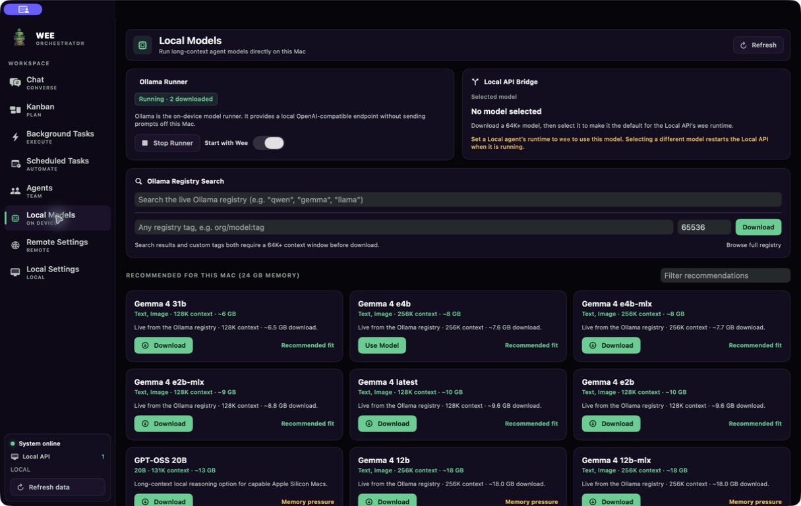

# 🍀 Wee-Orchestrator

**One platform for agents, runtimes, automation, and every client surface.**

[](https://python.org)
[](LICENSE)

Wee-Orchestrator is a self-hosted AI-agent API. It coordinates specialized
agents across GitHub Copilot, Claude, OpenCode, Gemini, Codex, Cursor, Devin,
and the built-in **Wee native runtime** for Ollama, OpenRouter, and compatible
providers. Use it from the browser Web UI, Telegram, WebEx, or the native
macOS app.

## What it includes

- Multi-agent chat with persistent sessions, runtime/model switching, and SSE.
- Kanban, background tasks, scheduled automations, task execution history, and
  agent configuration.
- Wee native tool calling: local code tools, agent delegation, and sourced web
  search.
- Local model support through Ollama, including long-context model discovery.
- Keychain-backed credentials in the macOS client; pairing/session auth in the
  API.

## Current macOS app

<p align="center">
  
</p>

The macOS client is a native desktop workspace for Chat, Kanban, agents,
background/scheduled tasks, local models, and separate Local/Remote API
settings. It can clone and bootstrap a local API checkout, manage Ollama, and
open multiple workspace windows.

Download the current app from the
[macOS release](https://github.com/leprachuan/Wee-Orchestrator/releases/tag/macos-v0.1.0-20260712).
The app ships without credentials; configure them in Keychain-backed settings.

## Architecture

```text
Telegram ─┐
WebEx ────┼──► FastAPI API ──► SessionManager ──► Runtimes
Web UI ───┤         │                            ├─ CLI / SDK providers
macOS ────┘         ├──► TaskScheduler           └─ Wee native (Ollama/OpenRouter)
                      └──► History, Kanban, agents, auth, files, and settings
```

The API owns sessions, authorization, task orchestration, and configured agent
workspaces. Clients consume the same authenticated `/api/v1` surface. The
macOS client can additionally supervise a local API process without mixing its
agents or credentials with a remote deployment.

## Install the API

```bash
git clone https://github.com/leprachuan/Wee-Orchestrator.git
cd Wee-Orchestrator

python3 -m venv .venv
. .venv/bin/activate
pip install -r requirements.txt

cp .env.example .env
# Edit .env and agents.json for this host. Do not commit either file.

python agent_manager.py --api
```

Open `http://127.0.0.1:8000/ui` for the Web UI. Start `telegram_connector.py`
and/or `webex_connector.py` only when those channels are configured.

For production or networked access, bind the API only to trusted interfaces;
do **not** use `API_HOST=0.0.0.0`. See [network access guidance](docs/dev-access.md).

## Install and configure the macOS app

1. Download and unzip the current [macOS release](https://github.com/leprachuan/Wee-Orchestrator/releases/tag/macos-v0.1.0-20260712).
2. Move `WeeOrchestrator.app` to Applications and open it. The ad-hoc-signed
   build may require an initial macOS Open/allow action.
3. Use **Remote Settings** to enter your API URL and pair/sign in, or use
   **Local Settings** to clone, bootstrap, and start a local API on the Mac.
4. Use **Local Models** to install/start Ollama and download a 64K+ context
   model for the `wee` runtime. Optional OpenRouter access is configured in
   Local Settings and stored only in macOS Keychain.

Use **File → New Window** to open another workspace window.

## Essential configuration

| Need | Configure it in |
|---|---|
| Agent workspaces and defaults | `agents.json` (or `AGENT_CONFIG_FILE`) |
| API host/port and runtime defaults | `.env` / process environment |
| Telegram/WebEx credentials | API secure-secret flow or host secret store |
| OpenRouter key for Wee native | `OPENROUTER_API_KEY` in the host secret environment, or macOS Local Settings |
| Local Ollama endpoint | `WEE_OLLAMA_HOST`, normally `http://127.0.0.1:11434` |

Never commit API keys, bearer/session tokens, shared keys, bot tokens, or
`.env` files. Every API request requires an authenticated bearer token.

## Detailed documentation

- [Operations and API reference](docs/OPERATIONS_GUIDE.md)
- [Local runtime and client update](docs/LOCAL_RUNTIME_AND_CLIENTS_2026-07.md)
- [Architecture](ARCHITECTURE.md)
- [Context-window management](docs/context-window.md)
- [Network access guidance](docs/dev-access.md)
- [Release notes](RELEASE_NOTES.md) and [change history](CHANGELOG.md)

## Contributing

Open an issue before starting a feature or bug fix, keep credentials out of
source control, and run the relevant tests before submitting changes.
