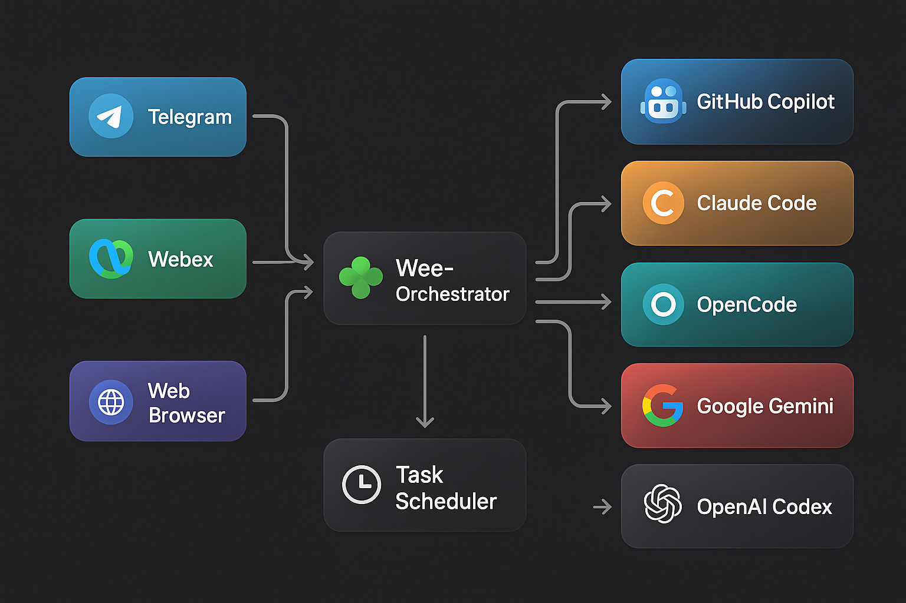

# Wee-Orchestrator Operations and API Reference

This is the detailed reference formerly kept in the top-level README. For the
product overview, architecture, installation, macOS client, and essential
configuration, start with the [repository README](../README.md).

[](https://python.org)
[](../LICENSE)

Wee-Orchestrator is a unified AI-agent platform for GitHub Copilot, Claude Code, OpenCode, Google Gemini, OpenAI Codex, and the built-in **Wee native runtime** (Ollama, OpenRouter, and other OpenAI-compatible providers). Use it from Telegram, WebEx, the browser Web UI, or the native **macOS desktop app**. Switch models, agents, and runtimes on the fly; schedule recurring work; run long-lived background tasks; and keep conversations, Kanban work, and agent settings together.

<p align="center">
  
</p>

---

## ✨ Why Wee-Orchestrator?

| Problem | Wee-Orchestrator Solution |
|---------|---------------------------|
| Juggling multiple AI tools and CLIs | **One unified interface** across CLI, SDK, and Wee-native runtimes with live model discovery |
| AI is stuck in the terminal | **Chat from anywhere** — Telegram, WebEx, Web UI, or the native macOS app |
| No memory between sessions | **Persistent sessions** with full conversation history |
| Can't automate AI tasks | **Built-in task scheduler** with cron-like scheduling |
| One-size-fits-all agents | **Multi-agent architecture** — switch agents per task |
| Complex setup | **Zero-config bot creation** with the [Starter Kit](https://github.com/leprachuan/wee-orchestrator-starter-kit) |

---

## 🚀 Key Features

- **🔀 AI runtimes** — GitHub Copilot CLI/SDK, Claude Code/SDK, OpenCode, Google Gemini, OpenAI Codex, Cursor, Devin, and Wee native (Ollama/OpenRouter/OpenAI-compatible)
- **💬 Client surfaces** — Telegram bot, WebEx bot (via RabbitMQ), browser Web UI with SSE streaming, and the native macOS app
- **🤖 Multi-Agent** — Define specialized agents in `agents.json`, switch with `/agent`; **hot-reload** on change (no restart needed)
- **🔄 Live Model Switching** — Change models mid-conversation with `/model`
- **📅 Task Scheduler** — Schedule recurring AI jobs with natural language (`every day at 9am`)
- **📁 File & Image Support** — Upload, download, and inline images across all channels
- **🎤 Audio Transcription** — Voice messages auto-transcribed via Whisper (OpenAI or local)
- **🔐 Secure Auth** — Pairing-code login, per-user ACLs, agent/model pinning, yolo/restricted modes
- **📜 Session History** — Full conversation persistence with search and resume
- **⚡ Background Tasks** — Delegate long-running work to background agents with in-thread status updates
- **🔔 In-Thread Notifications** — Real-time task lifecycle updates (queued → running → complete) in your conversation
- **📋 Dual-Source TODOs** — Sync TODOs between GitHub Issues (primary) and flat files (fallback) with auto-deduplication
- **🔧 Expandable Tool Calls** — View tool invocations with collapsible output panels in WebUI; markdown rendering, error highlighting, silent mode support
- **💰 Token Usage Tracking** — Real-time tracking of prompt/completion tokens per turn; context window usage percentage with 75% threshold warnings; live stats via `/tokens` in the CLI REPL
- **📐 Context Window Management** — Automatic per-model context window registry (20+ models); LLM-powered `/compact` command to summarize old history and free context space; see [Context Window Management](./context-window.md)
- **🖥️ Native macOS Client** — Local/remote environments, Kanban, tasks, scheduled-task history, local API controls, Ollama model management, voice input/output, and multiple windows
- **🔎 Wee Runtime Search** — Tool-backed web search with sourced results; local models do not stall after completing a search tool call
- **🔌 Extensible Skills** — Plugin architecture for adding capabilities (Cisco Meraki, Home Assistant, etc.)
- **⚙️ Slash Command Registry — Pure-server commands that bypass the LLM for reduced latency; auto-registers with Telegram BotFather for autocomplete; built-in `/secret` command for secure credential management

---

## 🏗️ Architecture

```
  Telegram ──► TelegramConnector ──┐
  WebEx ─────► WebEXConnector ─────┼──► FastAPI /api/v1 ──► SessionManager
  Browser ───► Web UI (SSE) ───────┤             │                 │
  macOS app ───────────────────────┘             │                 └──► Runtimes
                                                   │                      (Copilot, Claude,
                                            TaskScheduler                   OpenCode, Gemini,
                                                                            Codex, Wee Native)
```

Each inbound message flows through a **channel connector**, into the shared **SessionManager** (which handles slash commands, session state, and agent routing), and out to the selected **AI CLI runtime** as a subprocess. Responses stream back in real time.

For the full component diagram, sequence diagrams, and deployment topology, see **[ARCHITECTURE.md](../ARCHITECTURE.md)**.

---

## 📋 Overview

Wee-Orchestrator provides a flexible framework to:
- Chat with AI agents from **Telegram**, **WebEx**, the **browser-based Web UI**, or the **macOS app**
- Call AI CLIs and the Wee native runtime (Ollama/OpenRouter) from N8N workflows
- Maintain session affinity across multiple conversation turns
- Switch between different agent repositories dynamically
- Configure agents via JSON config files instead of hardcoding
- Support multiple AI models and runtimes
- Schedule recurring AI tasks with the built-in **Task Scheduler**
- Execute bash commands directly with `!` prefix
- Send and receive **files and images** over Telegram and WebEx
- Enforce per-user **agent pinning**, **model pinning**, and **yolo/restricted mode** ACLs

For release history and feature documentation see **[CHANGELOG.md](../CHANGELOG.md)** and **[RELEASE_NOTES.md](../RELEASE_NOTES.md)**.

## 🖥️ macOS Desktop App

The native macOS app is the fastest way to use Wee-Orchestrator as a desktop
workspace. It includes Chat, Kanban, Background Tasks, Scheduled Tasks, Agents,
separate Local/Remote settings, local API source management, and local Ollama
model management.

1. Download the current [macOS release](https://github.com/leprachuan/Wee-Orchestrator/releases/tag/macos-v0.1.0-20260712).
2. Unzip it, move `WeeOrchestrator.app` to Applications, and open it.
3. In **Remote Settings**, pair with your Wee API or enter an API endpoint and
   a Keychain-backed bearer token. Use **Local Settings** to clone/start an API
   on the Mac instead.

The app does not ship credentials. API tokens, OpenRouter keys, local shared
keys, and connector tokens are stored in macOS Keychain. The release is ad-hoc
signed, so macOS may require an initial Open/allow action until it is
Developer-ID notarized.

Use **File → New Window** for another workspace window. The app shares the
configured services while each window has its own navigation state.

For current client and local-runtime details, see
[Local Runtime and Clients](./LOCAL_RUNTIME_AND_CLIENTS_2026-07.md).

## ⚡ Quick Start — API server

```bash
# 1. Clone the repo
git clone https://github.com/leprachuan/Wee-Orchestrator.git
cd Wee-Orchestrator

# 2. Create an isolated Python environment and install dependencies
python3 -m venv .venv
. .venv/bin/activate
pip install -r requirements.txt

# 3. Configure your environment
cp .env.example .env    # Edit with your API keys and bot tokens

# 4. Define your agents
vi agents.json           # Add your agent definitions

# 5. Start the API server
python agent_manager.py --api

# 6. (Optional) Start channel connectors
python3 telegram_connector.py   # Telegram bot
python3 webex_connector.py      # WebEx bot
```

Then open `http://localhost:8000/ui` in your browser and pair via Telegram or WebEx.
For a local macOS-managed API, the desktop client can perform the clone,
dependency bootstrap, and launch steps from **Local Settings**.

> 🚀 **Want to create your own bot?** Use the **[Wee-Orchestrator Starter Kit](https://github.com/leprachuan/wee-orchestrator-starter-kit)** to scaffold one in minutes.

---

## 💬 Slash Commands

| Command | Description |
|---------|-------------|
| `/agent <name>` | Switch to a different agent |
| `/model <model>` | Change AI model mid-conversation |
| `/runtime <runtime>` | Switch runtime (copilot, claude, claude-sdk, gemini, opencode, copilot-sdk, codex, devin, cursor, wee) |
| `/timeout <seconds>` | Adjust execution timeout |
| `/status` | Check running task status |
| `/cancel` | Cancel the current running task |
| `/compact [N]` | Compact conversation history to N% of context window (default 50%) |
| `/schedule list` | List all scheduled jobs |
| `/schedule add <name> \| <schedule> \| <task>` | Create a scheduled job |
| `/tokens` | Show token usage stats and context window percentage |
| `/help` | Show all available commands |

---

## Bot Setup Guide

Wee-Orchestrator enables you to create **custom bots** — specialized AI agents with their own configuration, knowledge base, and capabilities. Each bot is a self-contained repository that can be integrated with Wee-Orchestrator.

> 🚀 **New here?** Use the **[Wee-Orchestrator Starter Kit](https://github.com/leprachuan/wee-orchestrator-starter-kit)** to scaffold a new bot in minutes — includes `AGENTS.md`, skill management with security scanning, memory structure, and setup scripts.

### What is a Bot?

A bot is a Git repository containing:

1. **Core Configuration** — An `AGENTS.md` file defining agent behavior, preferences, and runtime configurations
2. **Knowledge Base** — A `memory/` directory using the PARA methodology (Projects, Areas, Resources, Archive) for organizing operational knowledge
3. **Focus Areas** — Organized folders for specific domains (e.g., `email_triage/`, `smart_home/`, `infrastructure/`)
4. **Skills Integration** — References to specialized skills from [pot-o-skills](https://github.com/leprachuan/pot-o-skills) or custom skills
5. **Documentation** — README, guides, and workflow documentation

### Example Bot Structure

```
my-bot/
├── README.md                  # Bot overview & usage
├── AGENTS.md                  # Agent behavior & configuration
├── .env                       # Credentials (git-ignored)
├── .gitignore                 # Protect secrets
│
├── memory/                    # Knowledge base (PARA methodology)
│   ├── projects/              # Active multi-step initiatives
│   ├── areas/                 # Ongoing responsibility areas
│   ├── resources/             # Reference material & best practices
│   └── archive/               # Completed/deprecated items
│
├── skills/                    # Custom skill implementations
│   ├── custom-skill-1/
│   └── custom-skill-2/
│
└── domain-folders/            # Domain-specific organization
    ├── email/                 # Email processing
    ├── home-automation/       # Smart home tasks
    └── infrastructure/        # Infrastructure management
```

### Key Components

#### AGENTS.md
Defines the bot's behavior, preferences, and runtime configuration:
- Agent name, purpose, and timezone
- Preferred models and runtimes (Claude, Copilot, Gemini)
- Tool permissions and access control
- Sub-agent delegation rules
- Skill definitions and repository locations
- Security and credential management

**Example excerpt:**
```yaml
---
name: my-bot
runtime: copilot
model: gpt-5-sonnet
timezone: EST/EDT
---

## Behavior

- Preferred AI runtime: Claude > Copilot > Gemini
- Task routing: Delegate to specialized sub-agents for domain expertise
- Notification channel: Telegram
```

#### Memory Structure (PARA)
Organize knowledge for long-term retention and reuse:

- **Projects/** — Active multi-step work (e.g., `home-automation-setup.md`)
- **Areas/** — Ongoing responsibilities (e.g., `orchestration.md`, `security.md`)
- **Resources/** — Reference material (e.g., `best-practices.md`, `api-docs.md`)
- **Archive/** — Completed or deprecated knowledge

#### Skills

Skills extend your bot's capabilities by providing pre-built integrations with external APIs and services. **Skills should be sourced from reputable, official repositories** to minimize security risks.

##### Recommended Skill Sources

1. **pot-o-skills** — Community skills for cloud networking and security
   - Repository: https://github.com/leprachuan/pot-o-skills
   - Skills: Cisco Meraki, Cisco Security Cloud Control, and more
   - Status: Public, open-source, actively maintained
   - Usage: Clone and link into your bot's `skills/` directory

2. **Anthropic Official Skills** — Official skills from Anthropic
   - Repository: https://github.com/anthropics/skills
   - Status: Official, production-ready
   - Security: Vetted and maintained by Anthropic team
   - Best for: Claude AI integration, code generation, analysis

3. **Custom Skills** — Implement your own domain-specific skills
   - Location: `./skills/` directory in your bot repository
   - Documentation: Must include SKILL.md, README, and examples
   - Security: You control the code and updates

##### ⚠️ Skills Security Guidelines

**Skills have full access to your system** — they can execute commands, read files, and call APIs. Follow these practices:

- ✅ **Only use official skills** from original software/service authors
  - Example: Use Cisco's official Meraki skill, not community forks
  - Example: Use Anthropic's official skills, not third-party versions

- ✅ **Validate before installation**
  - Review the source code in the skill repository
  - Check for hardcoded credentials or suspicious patterns
  - Verify the repository is actively maintained
  - Look for security issues reported in GitHub Issues

- ✅ **Use trusted repositories**
  - Official repos (Anthropic, GitHub, etc.)
  - Long-standing community projects with active maintainers
  - Projects with security policies and issue tracking
  - Avoid random GitHub repos without documentation or maintenance

- ⚠️ **Audit custom skills carefully**
  - Never trust a skill without reviewing its code first
  - Check for unintended API calls or data exfiltration
  - Validate input sanitization
  - Ensure credentials are handled safely

- ✅ **Keep skills updated**
  - Periodically review and update to latest versions
  - Subscribe to security advisories from skill repositories
  - Remove unused skills to reduce attack surface

##### Using Skills in Your Bot

```bash
# Link public skills from pot-o-skills (verified, open-source)
ln -s /opt/pot-o-skills/cisco-meraki ./skills/
ln -s /opt/pot-o-skills/cisco-security-cloud-control ./skills/

# Link Anthropic official skills (verified, official)
ln -s /opt/anthropic-skills/code-analysis ./skills/
ln -s /opt/anthropic-skills/file-operations ./skills/

# Or implement custom skills in skills/ directory
mkdir skills/my-custom-skill
```

##### Discovering Skills

- **pot-o-skills:** https://github.com/leprachuan/pot-o-skills
  ```bash
  cd /opt && git clone https://github.com/leprachuan/pot-o-skills.git
  ```

- **Anthropic Skills:** https://github.com/anthropics/skills
  ```bash
  cd /opt && git clone https://github.com/anthropics/skills.git
  ```

- **Custom Community Skills:** Search GitHub for `topic:agent-skills` with verification:
  - ✅ Active maintenance (recent commits)
  - ✅ Clear documentation
  - ✅ Security policy file
  - ✅ Public issue tracking

#### Domain Folders
Organize bot work by area of focus:
- Keep related scripts, templates, and documentation together
- Example: `email/` for email processing, `home/` for automation tasks
- Each folder can have its own README with domain-specific guidance

### Getting Started

> 💡 **Recommended:** Fork the **[Wee-Orchestrator Starter Kit](https://github.com/leprachuan/wee-orchestrator-starter-kit)** instead of starting from scratch — it includes everything below pre-configured with best practices, security scanning, and setup scripts.

1. **Create your bot repository:**
   ```bash
   mkdir my-bot && cd my-bot
   git init
   git remote add origin https://github.com/username/my-bot.git
   ```

2. **Add AGENTS.md:**
   Copy and customize the [AGENTS.md](../AGENTS.md) template from Wee-Orchestrator with your bot's preferences

3. **Create memory directory:**
   ```bash
   mkdir -p memory/{projects,areas,resources,archive}
   echo "# Knowledge Base" > memory/INDEX.md
   ```

4. **Add .env and .gitignore:**
   ```bash
   cp /opt/n8n-copilot-shim-dev/.env.example .env
   echo ".env" >> .gitignore
   echo "*.key" >> .gitignore
   echo "secrets.json" >> .gitignore
   ```

5. **Link or implement skills:**
   ```bash
   mkdir skills
   ln -s /opt/pot-o-skills skills/cisco-meraki
   ```

6. **Register with Wee-Orchestrator:**
   Update Wee-Orchestrator's `agents.json` to include your bot:
   ```json
   {
     "agents": [
       {
         "name": "my-bot",
         "path": "/opt/my-bot",
         "enabled": true
       }
     ]
   }
   ```

### Best Practices

- **Secrets First:** Store all credentials in `.env` (git-ignored), never commit secrets
- **Document Decisions:** Use `memory/areas/` to record architectural decisions and conventions
- **Skill Reuse:** Leverage [pot-o-skills](https://github.com/leprachuan/pot-o-skills) before building custom skills
- **Domain Organization:** Group related work into focused folders for maintainability
- **README Clarity:** Each folder should have clear purpose and examples

### Resources

- **Wee-Orchestrator:** https://github.com/leprachuan/Wee-Orchestrator
- **pot-o-skills:** https://github.com/leprachuan/pot-o-skills (Cisco Meraki, SCC, and more)
- **AGENTS.md Template:** See [./AGENTS.md](../AGENTS.md) for full configuration reference

---

## Requirements

This project requires one or more of the following AI CLI tools to be installed:

### Claude Code CLI

**Prerequisites:**
- Node.js 18+ (for npm installation) OR native binary support
- Anthropic API key for authentication

**Installation:**

Native binary (recommended):
```bash
curl -fsSL https://claude.ai/install.sh | bash
```

Or via npm:
```bash
npm install -g @anthropic-ai/claude-code
```

**Supported Systems:** macOS 10.15+, Linux (Ubuntu 20.04+/Debian 10+, Alpine), Windows 10+ (via WSL)

**Reference:** [Claude Code Quickstart Documentation](https://code.claude.com/docs/en/quickstart)

### GitHub Copilot CLI

**Prerequisites:**
- Node.js 22 or higher
- Active GitHub Copilot subscription (Pro, Pro+, Business, or Enterprise plan)
- GitHub account for authentication

**Installation:**

```bash
npm install -g @github/copilot
copilot  # Launch and authenticate
```

For authentication, use the `/login` command or set `GH_TOKEN` environment variable with a fine-grained PAT.

**Supported Systems:** macOS, Linux, Windows (via WSL)

**Reference:** [GitHub Copilot CLI Installation Guide](https://docs.github.com/en/copilot/how-tos/set-up/install-copilot-cli)

### OpenCode CLI

**Prerequisites:**
- Node.js or compatible runtime

**Installation (Recommended):**

```bash
curl -fsSL https://opencode.ai/install | bash
```

Or via npm:
```bash
npm i -g opencode-ai@latest
```

Alternative package managers:
- Homebrew: `brew install opencode`
- Scoop (Windows): `scoop bucket add extras && scoop install extras/opencode`
- Arch Linux: `paru -S opencode-bin`

**Supported Systems:** Windows, macOS, Linux

**Reference:** [OpenCode Documentation](https://opencode.ai/docs/)

### Google Gemini CLI

**Prerequisites:**
- Python 3.7 or higher
- Google Cloud account with Gemini API access
- Google API key for authentication

**Installation:**

```bash
pip install google-generativeai
# Or using the CLI wrapper
pip install gemini-cli
```

**Authentication:**

Set your API key as an environment variable:
```bash
export GOOGLE_API_KEY='your-api-key-here'
```

Or configure it in your shell profile:
```bash
echo 'export GOOGLE_API_KEY="your-api-key-here"' >> ~/.bashrc
source ~/.bashrc
```

**Supported Systems:** Windows, macOS, Linux

**Reference:** [Google Gemini API Documentation](https://ai.google.dev/tutorials/python_quickstart)

## Tool Permissions & Access Control

All AI runtimes in this system are configured with **full tool access** to enable read, write, and execute operations without approval prompts. This provides maximum automation capabilities.

### Permission Configuration by Runtime

#### GitHub Copilot CLI
- **Flags Used:** `--allow-all-tools --allow-all-paths`
- **Enables:** 
  - All MCP tools and shell commands without approval
  - Read/write/execute permissions for all files and directories
- **Security Note:** Gives Copilot the same permissions as your user account

#### Claude Code CLI
- **Flags Used:** `--permission-mode bypassPermissions`
- **Enables:**
  - Auto-approve all file edits, writes, and reads
  - Execute shell commands without approval
  - Access web/network tools without prompts
- **Also Known As:** YOLO mode or dontAsk mode

#### OpenCode CLI
- **Configuration:** Uses `opencode.json` file for permission settings
- **Required Setup:**
  1. Copy the example config: `cp opencode.example.json opencode.json`
  2. Place `opencode.json` in your agent directories or project root
- **Permissions Enabled:**
  - `edit`: allow
  - `write`: allow
  - `bash`: allow
  - `read`: allow
  - `webfetch`: allow
- **Reference:** [OpenCode Permissions Documentation](https://opencode.ai/docs/permissions/)

#### Google Gemini CLI
- **Flags Used:** `--yolo`
- **Enables:**
  - Read/write file operations without confirmation
  - Shell command execution without approval
  - All built-in tools with unrestricted access
- **Built-in Tools:** read_file, write_file, run_shell_command

#### OpenAI Codex CLI
- **Flags Used:** `--dangerously-bypass-approvals-and-sandbox`
- **Enables:**
  - Disables all approval prompts
  - Removes sandbox restrictions (full file system access)
  - Allows all shell commands and tools without confirmation
- **Security Note:** Only use in trusted, controlled environments

#### Claude Agent SDK (Python)
- **Package:** `claude-agent-sdk>=0.1.0` (install via `pip install claude-agent-sdk`)
- **Enables:**
  - In-process async execution (no subprocess spawn)
  - Structured error types (`CLINotFoundError`, `CLIConnectionError`, `ProcessError`)
  - Native `permission_mode` field instead of CLI flags
  - Session continuity via `ResultMessage.session_id` capture
- **Permission Modes:**
  - `elevated` → `bypassPermissions` (full access, no prompts)
  - `sandboxed` → `plan` (read-only + approval for writes)
  - `restricted` → `default` (standard safety checks)
- **Streaming:** Real-time text chunks pushed to WebUI SSE consumers via `_StreamBuffer`
- **Tool Calls:** `ToolUseBlock`/`ToolResultBlock` detection emits standardized tool_call events
- **Usage:** `/runtime set claude-agent-sdk`
- **Issues:** [#77](../../issues/77), [#87](../../issues/87), [#91](../../issues/91), [#94](../../issues/94)

#### GitHub Copilot SDK (Python)
- **Package:** `github-copilot-sdk>=0.1.0` (install via `pip install github-copilot-sdk`)
- **Enables:**
  - In-process async execution via `CopilotClient`
  - Real-time streaming via `ASSISTANT_STREAMING_DELTA`/`ASSISTANT_MESSAGE_DELTA` events
  - Tool call tracking via `TOOL_EXECUTION_START`/`COMPLETE` and `COMMAND_EXECUTE` events
  - Session resumption and structured error handling
- **Usage:** `/runtime set copilot-sdk`
- **Issues:** [#76](../../issues/76), [#87](../../issues/87), [#91](../../issues/91)

#### Wee Native Runtime
- **Also Known As:** `wee` — the built-in runtime for local and BYOK providers
- **Description:** Runs a turn through the **GitHub Copilot SDK** in BYOK mode against an OpenAI-compatible endpoint (Ollama, OpenRouter, LM Studio). The SDK owns the agentic loop and its own tools; wee supplies the provider route and a few extra tools on top.
- **Architecture note (issue #443):** wee previously drove its own tool-calling loop (`_run_wee_openai_fallback`) against the provider directly. That loop was removed. If you are reading older notes that describe wee assembling `tool_calls` rounds itself, or a `wee_runtime.execute_tool` dispatcher, that is no longer how it works.
- **Supported Backends:**
  - **Ollama** at `http://192.168.1.101:11434/v1` — local, free (Kubuntu)
  - **OpenRouter** at `https://openrouter.ai/api/v1` — cloud fallback, 100+ models
  - **LM Studio** at `http://localhost:1234/v1` — local alternative
- **Model Format:** Uses `provider/model_name` prefix syntax for auto-resolving API base URL and API key:
  - `ollama/gemma4:e4b` — Ollama on Kubuntu (default)
  - `openrouter/meta-llama/llama-4-scout` — OpenRouter cloud
  - `lmstudio/qwen2.5-7b` — LM Studio local
- **Configuration Example:**
  ```json
  {
    "runtime": "wee",
    "model": "ollama/gemma4:e4b"
  }
  ```
- **Environment Variables:**
  - `WEE_API_BASE` — Override API base URL (e.g., `http://192.168.1.101:11434/v1`)
  - `WEE_API_KEY` — API key for authenticated endpoints (OpenRouter, etc.)
  - `WEE_DEFAULT_MODEL` — Default model when model not specified in config
  - `WEE_SEARXNG_URL` — SearXNG base URL for the `search` tool (default: `http://127.0.0.1:8888`). **The instance must serve `format=json`**; SearXNG ships with only `html` enabled and answers `403` otherwise, which silently pushes every search onto the fallback. Add to its `settings.yml`:
    ```yaml
    search:
      formats:
        - html
        - json
    ```
- **Tools wee registers on top of the SDK:**
  - `search` — Web search via SearXNG, with a public-search fallback (`q`, `count` up to 20, `format` json/text). The SDK has **no** web search of its own — its `web_fetch` only retrieves a URL you already know — which is why this is registered (issue #397).
  - `call_agent` — Delegate to a Wee Orchestrator sub-agent (quick or background mode)
  - `browser` — Drive the browser attached to this chat session
- **Tools the SDK provides itself** (do not redeclare these; the list can drift):
  `apply_patch`, `bash`, `glob`, `list_agents`, `list_bash`, `read_agent`,
  `read_bash`, `rg`, `skill`, `sql`, `stop_bash`, `task`, `view`, `web_fetch`
- **Features:**
  - Real-time streaming to the WebUI and macOS client
  - Provider routes auto-resolve base URLs and API keys from the model prefix
  - Context usage reported per turn and surfaced in both clients (issue #423)
  - Recovers a turn that only *announced* an action without calling a tool, by
    re-prompting once with an explicit completion instruction (issue #398)
- **Implementation:** `run_wee_native()` in `agent_manager.py`, executing through
  `wee_copilot_sdk.execute_wee_copilot`; `wee_runtime.py` still provides
  `_execute_search` and the standalone CLI path
- **Choosing a local Ollama model (important):** the agent prompt is roughly
  14 KB before you type anything, so a model whose allocated context cannot hold
  it has no room left to generate and the turn dies after about one token. The
  deciding factor is the **`num_ctx` baked into the model's Modelfile**, not the
  architecture's context length — Ollama reports `context_length = 131072` for
  models that will and will not work.

  Check with `curl -s http://<host>:11434/api/show -d '{"model":"<model>"}'` and
  look for `num_ctx` under `parameters`. A model with no `num_ctx` falls back to
  Ollama's small default and cannot be used. Either pick a variant with a large
  `num_ctx` baked in, or set `OLLAMA_CONTEXT_LENGTH` on the Ollama host.

  Known-good on the current host: `gpt-oss:64k`, `gemma4-e2b-128k:latest`,
  `nemotron-3-nano:128k`. Known-bad: `gemma4:e4b` (no `num_ctx`).

  The runtime checks this before spending a turn and returns an actionable error
  naming the model and its `num_ctx` (issues #421 / #451). There is no way to set
  `num_ctx` per request through the SDK, so model selection is the lever.
- **Usage:** `/runtime set wee`

- **Features & Improvements:**
  - OpenRouter integration: Full UI support for cloud-based models with 300s cached discovery & keyring-based API key management (Issue #119)
  - Global notification toggle: Suppress all background task notifications with `/notifications off`; critical alerts always deliver (Issue #146)
  - Model grouping in UI: Ollama and OpenRouter models displayed in separate dropdown optgroups
  - All OpenRouter models in model listing: Removed hardcoded filter to show 350+ OpenRouter models instead of ~12 (Issue #145)

- **Bug Fixes:**
  - Wrong Ollama port corrected: `11436` → `11434` (Issue #105)
  - `httpx.Timeout(connect=15s)` and `max_retries=0` added to OpenAI client for fast-fail on bad endpoints (Issue #105)
  - Model resolution fixed: `get_models_for_runtime('wee')` returns flat strings; `get_model_from_name()` strips provider prefix (`ollama/`) and prefers exact/shortest match (Issue #105)
- **Bug Fixes (continued):**
  - OpenRouter 401 auth fixed: `OPENROUTER_API_KEY` env var + keyring resolution replaces silent `'ollama'` fallback; raises clear error when no key found (Issue #153)
- **Issues:** [#88](../../issues/88), [#105](../../issues/105), [#119](../../issues/119), [#146](../../issues/146), [#153](../../issues/153), [#255](../../issues/255)

### Context Window Management (Wee CLI)

The `wee` runtime includes automatic context window tracking and LLM-powered compaction via `wee_cli.py`.

#### TokenTracker

`TokenTracker` monitors token usage per session and computes context window utilisation:

| Field | Description |
|-------|-------------|
| `last_prompt_tokens` | Token count from the most recent API request |
| `last_completion_tokens` | Token count from the most recent response |
| `context_window` | Model's maximum context size (from registry) |
| `percent_used()` | `last_prompt_tokens / context_window × 100` |

```
/status → Token usage: 12,400 / 128,000 tokens (9.7% used)
```

#### Model Context Window Registry

Context sizes are resolved automatically from `MODEL_CONTEXT_WINDOWS` in `wee_runtime.py` (longest-match substring lookup, falls back to 4,096 tokens):

| Model Family | Context Window |
|-------------|----------------|
| GPT-5, GPT-4.1, GPT-4.1-mini/nano | 1,047,576 |
| GPT-4o, GPT-4-turbo, GPT-4o-mini | 128,000 |
| Claude 3 | 200,000 |
| Claude 2 | 100,000 |
| Llama 3 | 131,072 |
| Gemma 4, Gemma 3 | 131,072 |
| Phi-3 | 128,000 |
| DeepSeek | 65,536 |
| Mistral, Mixtral, Qwen | 32,768 |
| Default (unrecognised) | 4,096 |

#### /compact Command

Manually trigger context compaction when approaching the window limit:

```
/compact       # Compact to 50% of context window (default)
/compact 40    # Compact to 40% of context window
```

**How it works:**
1. Preserves the system prompt and the 6 most recent messages.
2. Summarises older messages into a concise context-summary block using the LLM.
3. Replaces old history with the summary + recent turns.
4. Prints before/after message count and token estimates.

```
Compacted: 42 messages → 8 messages (8,250 → 3,100 tokens)
```

**Automatic warning** at ≥ 75% usage:
```
⚠️  Context window at 78.3% — consider /compact to free space.
```

**Issues:** [#273](../../issues/273)

### Security Considerations

⚠️ **Warning:** These configurations grant AI agents extensive system access:

- **Full file system access:** Can read, modify, or delete any file your user can access
- **Command execution:** Can run any shell command with your user privileges
- **No safety prompts:** All operations execute automatically without confirmation

**Best Practices:**
1. **Use in controlled environments:** Development containers, VMs, or sandboxed systems
2. **Regular backups:** Maintain backups of critical files and directories
3. **Code review:** Review AI-generated changes before committing to production
4. **Limit agent scope:** Configure agents to work in specific project directories
5. **Monitor activity:** Review session logs and agent outputs regularly

**Recommended Use Cases:**
- ✅ Development and testing environments
- ✅ Automated CI/CD pipelines in isolated containers
- ✅ Personal projects with version control
- ❌ Production systems without review
- ❌ Shared systems with sensitive data
- ❌ Public or untrusted environments

## Configuration

### Agent Configuration

The system loads agents from `agents.json` or a custom config file. Each agent represents a repository context where the AI CLI will operate.

**Config Format:**
```json
{
  "agents": [
    {
      "name": "devops",
      "description": "DevOps and infrastructure management",
      "path": "/path/to/MyHomeDevops"
    },
    {
      "name": "projects",
      "description": "Software development projects",
      "path": "/path/to/projects"
    }
  ]
}
```

**Configuration Fields:**
- `name` (required): Short identifier for the agent (used in `/agent set` commands)
- `description` (required): Brief human-readable description of the agent
- `path` (required): Full path to the repository or project directory

### Environment Configuration

> ⚠️ **`API_HOST` Security Warning**
> Never set `API_HOST=0.0.0.0` — this exposes the server on every network interface
> including your LAN and any public NIC.  Always bind to specific trusted interfaces
> (e.g. `127.0.0.1,<tailscale-ip>`).  See [Network Binding & Secure Access](#network-binding--secure-access).

The default agent, model, and runtime can be customized via environment variables. This is useful for:
- Different users having different defaults
- Docker container configuration
- CI/CD pipeline customization
- Development vs. production setups

**Available Environment Variables:**

```bash
# Default agent for new sessions
COPILOT_DEFAULT_AGENT=orchestrator        # Default: orchestrator

# Default model for new sessions  
COPILOT_DEFAULT_MODEL=gpt-5-mini          # Default: gpt-5-mini

# Default runtime for new sessions
COPILOT_DEFAULT_RUNTIME=copilot           # Default: copilot

# Optional local Wee-native runner endpoint (for ollama/<model>)
WEE_OLLAMA_HOST=http://127.0.0.1:11434

# Optional OpenRouter credential for openrouter/<provider>/<model>.
# Set this in the host's secret store or process environment; never commit it.
OPENROUTER_API_KEY=<set-outside-source-control>
```

**Usage Examples:**

```bash
# Set orchestrator as default
export COPILOT_DEFAULT_AGENT=orchestrator
export COPILOT_DEFAULT_RUNTIME=copilot

# Or set family agent with Claude runtime
export COPILOT_DEFAULT_AGENT=family
export COPILOT_DEFAULT_MODEL=claude-sonnet
export COPILOT_DEFAULT_RUNTIME=claude

# Run the agent
python3 agent_manager.py "Your prompt" "session_id"
```

**Docker Example:**

```dockerfile
ENV COPILOT_DEFAULT_AGENT=orchestrator
ENV COPILOT_DEFAULT_MODEL=gpt-5-mini
ENV COPILOT_DEFAULT_RUNTIME=copilot
```

**Reference Configuration:**

Copy `.env.example` to `.env` and customize:

```bash
cp .env.example .env
# Edit .env with your defaults
```

When environment variables are not set, the system uses these hardcoded defaults:
- Agent: `orchestrator`
- Model: `gpt-5-mini`
- Runtime: `copilot`

### Setup

1. **Copy the agent manager script:**
   ```bash
   cp agent_manager.py /usr/local/bin/agent-manager
   chmod +x /usr/local/bin/agent-manager
   ```

2. **Configure your agents:**
   - Copy `agents.example.json` to `agents.json`
   - Edit `agents.json` with your actual repository paths
   - Place `agents.json` in the same directory as the script or current working directory

3. **Optional: Specify config location via environment variable**
   ```bash
   export AGENTS_CONFIG=/path/to/custom/agents.json
   ```

## Usage

### Command Line

The agent manager supports both positional arguments (for backwards compatibility) and named options for more flexibility.

#### Basic Usage (Positional Arguments)

```bash
python agent_manager.py "<prompt>" [session_id] [config_file]
```

**Arguments:**
- `prompt`: The prompt/command to send to the AI CLI
- `session_id` (optional): N8N session identifier for tracking conversations (default: "default")
- `config_file` (optional): Path to agents.json config file

**Examples:**
```bash
# Basic usage
python agent_manager.py "List all files in the current directory"

# With session ID
python agent_manager.py "Continue debugging the issue" "session-123"

# With custom config file
python agent_manager.py "Deploy the app" "session-456" "/etc/agents.json"
```

#### Advanced Usage (Named Arguments)

```bash
python agent_manager.py [options] "<prompt>" [session_id]
```

**Options:**

Agent Options:
- `--agent NAME` - Set the agent to use (e.g., devops, family, projects)
- `--list-agents` - List all available agents and exit

Model Options:
- `--model NAME` - Set the model to use (e.g., gpt-5, sonnet, gemini-1.5-pro)
- `--list-models` - List all available models for current runtime and exit

Runtime Options:
- `--runtime NAME` - Set the runtime to use (choices: copilot, opencode, claude, claude-agent-sdk, gemini, copilot-sdk, codex, devin)
- `--list-runtimes` - List all available runtimes and exit

Configuration:
- `--config FILE` or `-c FILE` - Path to agents.json configuration file

**Examples:**

```bash
# List available agents
python agent_manager.py --list-agents

# List available agents with custom config
python agent_manager.py --list-agents --config my-agents.json

# List available runtimes
python agent_manager.py --list-runtimes

# List available models
python agent_manager.py --list-models

# Set agent via CLI
python agent_manager.py --agent devops "Check server status"

# Set runtime and model via CLI
python agent_manager.py --runtime gemini --model gemini-1.5-pro "Analyze this code"

# Combine multiple options
python agent_manager.py --agent family --runtime claude --model sonnet "Find recipes for dinner"

# Use custom configuration file
python agent_manager.py --config /etc/my-agents.json --agent projects "Review pull requests"

# All options together
python agent_manager.py --config my-agents.json --agent devops --runtime claude --model haiku "Deploy to production" "session-123"
```

**Getting Help:**
```bash
python agent_manager.py --help
```

### Slash Commands

Interact with the agent manager using slash commands:

#### Bash Commands
```
!<command>                 # Execute bash command directly (e.g., !pwd, !ls -la)
```

**Examples:**
```bash
!pwd                       # Show current working directory
!echo "Hello World"        # Echo a message
!ls -lh                    # List files with details
!date                      # Show current date/time
!git status                # Run git commands
!python3 --version         # Check installed versions
```

**Features:**
- Commands execute directly without hitting any AI runtime
- 10-second timeout for safety
- Runs in current working directory
- Supports pipes, redirects, and command chaining (&&, ||, |)
- Returns stdout/stderr output

#### Runtime Management
```
/runtime list              # Show available runtimes (copilot, opencode, claude, gemini)
/runtime set <runtime>     # Switch runtime (e.g., /runtime set gemini)
/runtime current           # Show current runtime
```

#### Model Management
```
/model list                # Show available models for current runtime
/model set "<model>"       # Switch model (e.g., /model set "claude-opus-4.5")
/model current             # Show current model
```

#### Agent Management
```
/agent list                # Show all available agents with descriptions
/agent set "<agent>"       # Switch to an agent (e.g., /agent set "projects")
/agent current             # Show current agent and its context
```

#### Session Management
```
/session reset             # Reset the current session (starts fresh next message)
/help                      # Show all available commands
```

#### Query Management
```
/status                    # Check status of running query for this session
/cancel                    # Cancel running query for this session
```

#### Context Window Management
```
/compact           # Compact conversation history to 50% of context window (default)
/compact 40        # Compact to 40% of context window
```

**Automatic Warnings**: When the `wee` runtime is used, context usage is tracked after each turn. A warning is printed when usage reaches ≥ 75% of the model's context window:
```
⚠️  Context window at 78.3% — consider /compact to free space.
```

**Query Tracking**: When a query is executing, the agent manager tracks its process ID (PID), runtime, agent, and output. Use `/status` to check if a query is running and see recent output, or `/cancel` to terminate a long-running query.

#### Secrets Management
```
/secret set <name>         # Create/update a secret (value read from stdin)
/secret get <name>         # Retrieve a secret value
/secret list               # List all secret names (values redacted)
/secret delete <name>      # Remove a secret
```

**Features:**
- Secrets stored securely via `secret_tool.py` (never exposed in shell history or LLM context)
- Name validation: alphanumeric, dots, hyphens, underscores only (`^[A-Za-z0-9._-]+$`)
- stdin-based input prevents secrets from appearing in command history
- Pre-LLM dispatch — secrets never touch the AI model
- Supported on all channels (Telegram, WebEx, Web UI)

**Examples:**
```bash
echo "my-db-password" | /secret set db_password
/secret get db_password    # Returns: my-db-password
/secret list               # Returns: db_password, api_key, github_token
/secret delete db_password
```

#### Programmatic Secret Access in AI Agents (wee_executor)

AI agents running in privileged modes can retrieve secrets programmatically via the **`get_secret()` capability** in `wee_executor.py` (F024).

**When to use:**
- AI agents need secure access to credentials (API keys, database passwords) during task execution
- Secrets must never be logged or exposed to LLM context
- Only available in `interactive` and `sync` modes; blocked in `background` and `api` modes for security

**Requirements:**
1. **Elevation flag**: Task must run with `WEE_ELEVATED=true` in the session environment
2. **Name validation**: Secret names must match `^[A-Za-z0-9._-]+$` (alphanumeric, dot, hyphen, underscore)
3. **Mode restriction**: Only callable from `interactive` or `sync` mode sessions

**Capability signature:**
```python
# Called within an AI agent's context
get_secret(
    name: str,           # Secret name (e.g., "GITHUB_TOKEN")
    backend: str = "keyring"  # Storage backend: "keyring" or "file"
) -> Dict
# Returns: {status, name, backend, value} on success
#          {error, code} on failure (e.g., ELEVATION_REQUIRED, INVALID_NAME)
```

**Agent Context Injection:**
When an agent runs with `WEE_ELEVATED=true`, `agent_manager.py` automatically injects `get_secret()` documentation and usage examples into the agent's context. The agent can then call `get_secret()` to retrieve secrets needed for the task.

**Security:**
- 🔐 **Elevation requirement**: Prevents accidental secret access from untrusted agents
- 🛡️ **Name validation**: Blocks path traversal attempts (e.g., `../etc/passwd` rejected)
- 🚫 **Mode filtering**: Only in `interactive`/`sync` modes; disabled in `background`/`api` for API call safety
- 📋 **Audit logging**: All calls logged with name + backend; **secret values never logged** for compliance
- ⏱️ **Rate limiting**: 50 requests/minute per session to prevent brute-force attacks

**How it works:**
1. AI agent calls `get_secret(name="GITHUB_TOKEN", backend="keyring")`
2. `wee_executor.py` validates the name and checks `WEE_ELEVATED=true`
3. Subprocess delegates to `secret_tool.py` to retrieve the secret value
4. Secret is returned to the agent but never written to logs
5. Agent can use the secret for its task (e.g., authenticate to GitHub API)

**Example agent usage (conceptual):**
```
Agent (with WEE_ELEVATED=true):
  "I need to push code to GitHub. Let me get my credentials."
  
  get_secret(name="GITHUB_TOKEN", backend="keyring")
  → {status: "success", name: "GITHUB_TOKEN", value: "ghp_...", backend: "keyring"}
  
  # Now the agent has the token and can authenticate API calls
```

**Available backends:**
- `keyring` (default): System keyring (GNOME Keyring, Macos Keychain, etc.)
- `file`: Encrypted JSON store (requires `cryptography` + `python-keyring`)

See **[docs/secret-tool.md](./secret-tool.md)** for CLI and storage backend details.

### N8N Integration

Use in an N8N workflow:

#### Basic N8N Integration (Positional Arguments)
```javascript
// Execute the agent manager from N8N
const { exec } = require('child_process');
const prompt = "Your prompt here";
const sessionId = "n8n_session_123";
const configFile = "/path/to/agents.json";

exec(`python agent_manager.py "${prompt}" "${sessionId}" "${configFile}"`,
  (error, stdout, stderr) => {
    if (error) console.error(error);
    console.log(stdout);
  }
);
```

#### Advanced N8N Integration (Named Arguments)
```javascript
// Execute with specific agent, runtime, and model
const { exec } = require('child_process');
const agent = "devops";
const runtime = "claude";
const model = "sonnet";
const prompt = "Check production status";
const sessionId = "n8n_session_123";

const cmd = `python agent_manager.py --agent ${agent} --runtime ${runtime} --model ${model} "${prompt}" "${sessionId}"`;

exec(cmd, (error, stdout, stderr) => {
  if (error) console.error(error);
  console.log(stdout);
});
```

#### List Agents from N8N
```javascript
// Get available agents dynamically
const { exec } = require('child_process');
const configFile = "/path/to/agents.json";

exec(`python agent_manager.py --list-agents --config ${configFile}`,
  (error, stdout, stderr) => {
    if (error) console.error(error);
    // Parse stdout to get agent list
    console.log(stdout);
  }
);
```

## Session Management

Sessions are automatically tracked and stored in:
- **Copilot:** `~/.copilot/n8n-session-map.json`
- **OpenCode:** `~/.opencode/n8n-session-map.json`
- **Claude:** `~/.claude/` (debug directory)
- **Gemini:** `~/.gemini/sessions/`

Each N8N session ID is mapped to:
- A unique backend session ID (for resuming AI CLI sessions)
- Current runtime (copilot/opencode/claude/claude-agent-sdk/gemini/copilot-sdk)
- Current model
- Current agent

Session data persists across requests, allowing multi-turn conversations.

### Query Tracking

Running queries are tracked in `~/.copilot/running-queries.json` with:
- **PID**: Process ID for the running query
- **Runtime**: Which AI runtime is executing the query
- **Agent**: Which agent context is being used
- **Start Time**: When the query started
- **Last Output**: Recent output snippet (last 500 characters)

This enables the `/status` and `/cancel` commands to monitor and control long-running queries.

## Default Behavior

When creating a new session:
- **Runtime:** copilot (use `/runtime set` to change)
- **Model:** gpt-5-mini (Copilot) / opencode/gpt-5-nano (OpenCode) / haiku (Claude) / gemini-1.5-flash (Gemini)
- **Agent:** devops (or first available agent from config)

### Background Task Agent Isolation (#75)
When a background task is created without an explicit `agent` field, the system resolves the agent via `get_default_agent()` — **never** from an existing session. This prevents session agent leakage where a task dispatched from a specialized agent session (e.g., `devops`) would silently run under that agent instead of the system default.

**Safe inherited fields** (copied from existing same-identity sessions):
- `runtime` — inherits the session's active runtime
- `model` — inherits the session's active model
- `notification_preference` — inherits notification routing preference

**Never inherited from sessions:**
- `agent` — always resolved from the request body or system default

This guarantee is enforced in `_compute_bg_task_defaults()` via an explicit `SAFE_FIELDS` whitelist. Agent must be explicitly provided in the request body to override the default:
```json
{
  "prompt": "Deploy the app",
  "agent": "devops"
}
```

## Advanced Features

### Dynamic Agent Loading
Instead of hardcoding agent paths, the system:
1. Looks for `agents.json` in the current directory
2. Falls back to the script directory if not found
3. Supports custom config paths via argument

### Session Resumption
- The system automatically detects and resumes existing sessions
- If a session is lost or corrupted, it starts a fresh session automatically
- Use `/session reset` to explicitly clear session state

### Model Resolution
The system intelligently matches model names:
- Exact matches (case-insensitive)
- Substring/suffix matching
- Latest version preference for ambiguous matches

### Metadata Stripping
Automatically removes CLI metadata from output:
- Thinking tags (`<think>...</think>`)
- Token usage statistics
- Session headers and banners

### Session Memory Injection
Memory context is automatically injected at session creation time for all code paths:
- **When**: Memory is injected once per session in `build_agent_context_prompt()` when the session is first created
- **What**: MEMORY.md (persistent facts) and daily notes (today/yesterday timestamps) from `memories/daily/`
- **Scope**: All session types — background tasks, interactive sessions, queued jobs, and promoted sessions
- **Single Injection**: The `memory_injected` flag ensures context is prepended exactly once per session, preventing duplication
- **Sub-Task Handling**: Sub-tasks created from within a background task (via `origin_session_id`) automatically skip re-injection
- **Fail-Silent**: If memory files are missing, tasks continue without context (no errors)
- **No Wrapper Block**: Memory sections are injected raw without [MEMORY CONTEXT] wrapper markers for cleaner output

This unified approach ensures all agents have access to relevant context without fragile prompt-based injection or code-path-specific handling.

## Testing

A comprehensive test suite is included to ensure code quality and prevent regressions when making changes.

### Running Tests

#### Stateless Query Endpoint

| Method | Path | Description |
|--------|------|-------------|
| `POST` | `/api/v1/query` | One-shot stateless query endpoint |

**POST /api/v1/query** — Execute a single query without session management

A lightweight, ephemeral-session endpoint for programmatic AI queries. Perfect for CI/CD pipelines, scripts, and integrations that don't need persistent session state.

Request body (JSON):
```json
{
  "prompt": "What is 2 + 2?",
  "runtime": "copilot",
  "model": "claude-haiku-4.5",
  "agent": "orchestrator",
  "timeout": 60
}
```

Response (200 OK):
```json
{
  "response": "2 + 2 = 4",
  "runtime": "copilot",
  "model": "claude-haiku-4.5",
  "elapsed_ms": 2150
}
```

**Parameters:**
- `prompt` (string, required) — The query or command to send to the AI runtime
- `runtime` (string, required) — AI runtime: `copilot`, `opencode`, `claude`, `gemini`, or `codex`
- `model` (string, required) — Model name or alias (e.g., `claude-haiku-4.5`, `gpt-5-mini`)
- `agent` (string, optional) — Agent context to use (default: `orchestrator`)
- `timeout` (integer, optional) — Query timeout in seconds (default: 60)

**Error responses:**
- `400 Bad Request` — Missing required fields (`prompt`, `runtime`, `model`) or invalid JSON
- `401 Unauthorized` — Missing or invalid Bearer token
- `404 Not Found` — Unknown runtime, model, or agent
- `429 Too Many Requests` — Rate limit exceeded (30 requests per minute per IP)
- `504 Gateway Timeout` — Query exceeded specified timeout

**Features:**
- **Stateless** — No session created; ephemeral context cleaned up automatically after response
- **Rate Limited** — 30 requests/minute per IP address (sliding window)
- **Full Control** — Choose runtime, model, and agent per request
- **Security** — Requires API authentication; executes with the authority of the calling user/token

**Security:**
- Requires API authentication (Bearer token or shared-key validation)
- Runs with the authority of the calling API user (rate-limited by IP)
- Ephemeral sessions are not persisted or visible in session history
- Input validation prevents agent/model traversal attacks

#### Memory Promotion

| Method | Path | Description |
|--------|------|-------------|
| `POST` | `/api/v1/memory/promote` | Promote memory for a single agent (or orchestrator) |
| `POST` | `/api/v1/memory/promote-all` | Promote memory across all agents in agents.json |

**POST /api/v1/memory/promote** — Trigger memory promotion for a single agent

Consolidates daily notes (`/memories/daily/*.md`) into the agent's `MEMORY.md` using LLM analysis. Durable facts are elevated, duplicates removed, and the knowledge base refreshed.

Request body (JSON):
```json
{
  "agent": "devops"  // Optional — if omitted, promotes orchestrator memory
}
```

Response (200 OK):
```json
{
  "status": "ok",
  "agent": "devops",
  "agent_path": "/opt/MyHomeDevops",
  "stdout": "Promoted 8 facts from 3 daily notes...",
  "stderr": "",
  "returncode": 0
}
```

Error responses:
- `401 Unauthorized` — Missing or invalid Bearer token
- `404 Not Found` — Unknown agent name
- `503 Service Unavailable` — Memory promoter script not found
- `504 Gateway Timeout` — Promotion exceeded 120-second timeout
- `500 Internal Server Error` — Subprocess error or other failure

**POST /api/v1/memory/promote-all** — Trigger memory promotion for ALL agents

Iterates through every agent in `agents.json` (including orchestrator) and runs memory promotion for each. Handles partial failures gracefully — continues promotion for other agents if one fails.

Request body: Empty or omitted

Response (200 OK):
```json
{
  "status": "ok",
  "total": 4,
  "succeeded": 4,
  "failed": 0,
  "results": [
    {
      "agent": "orchestrator",
      "agent_path": "/opt/memories",
      "status": "ok",
      "returncode": 0,
      "stdout": "..."
    },
    {
      "agent": "devops",
      "agent_path": "/opt/MyHomeDevops",
      "status": "ok",
      "returncode": 0,
      "stdout": "..."
    }
  ]
}
```

**Security:**
- Both endpoints require API authentication (Bearer token or shared-key validation)
- Memory promotion is read-only for daily notes, write-only to MEMORY.md
- Agent path resolved from agents.json; prevents directory traversal

**Helper Script:**
For scheduling memory promotion via the task scheduler or cron:
```bash
bash scripts/promote_all_agents_memory.sh
```

**PATCH /api/v1/sessions/{id}/settings** — Update session settings

Modify session-level settings like verbose mode (tool call visibility). Settings are persisted and returned in subsequent session queries.

Request body (JSON):
```json
{
  "silent_mode": false  // Show tool call lines; set to true to hide
}
```

Response (200 OK):
```json
{
  "id": "sess_abc123",
  "silent_mode": false,
  "created_at": "2026-04-03T20:00:00Z",
  "updated_at": "2026-04-03T21:05:42Z"
}
```

Error responses:
- `401 Unauthorized` — Missing or invalid Bearer token
- `404 Not Found` — Session does not exist
- `422 Unprocessable Entity` — Invalid value (e.g., non-boolean for `silent_mode`)

**Features:**
- Whitelist-based field filtering — only recognized fields are accepted (currently: `silent_mode`)
- WebUI toggle button in header reflects and controls this setting
- Tool call lines (`.tc-line`) hidden when `silent_mode=true`, shown when `false`
- Does not affect logging or session history — only visual display

**Security:**
- Requires API authentication (Bearer token)
- Per-session settings — each user session has independent configuration

**POST /api/v1/query** — Stateless one-shot query endpoint

Execute a prompt without managing sessions. The endpoint creates an ephemeral session internally, runs the prompt, returns the result, and cleans up automatically. Ideal for evaluators, CI checks, and fire-and-forget queries.

| Method | Path | Description |
|--------|------|-------------|
| `POST` | `/api/v1/query` | Execute a one-shot query; no session state retained |

Request body (JSON):
```json
{
  "prompt": "What is 2 + 2?",
  "runtime": "copilot",
  "model": "claude-haiku-4.5",
  "agent": "orchestrator",
  "timeout": 120
}
```

| Field | Type | Required | Description |
|-------|------|----------|-------------|
| `prompt` | string | ✅ | Query text (max 10,000 characters) |
| `runtime` | string | No | Runtime to use: `copilot`, `claude` (default: `copilot`) |
| `model` | string | No | Model name; defaults to runtime's configured default |
| `agent` | string | No | Agent name from `agents.json`; defaults to `orchestrator` |
| `timeout` | integer | No | Execution timeout in seconds (default: 120) |

Response (200 OK — successful execution):
```json
{
  "result": "4",
  "runtime": "copilot",
  "model": "claude-haiku-4.5",
  "agent": "orchestrator",
  "elapsed": 1.42
}
```

**Error Detection** (#67): When the runtime response contains a known error pattern, the endpoint returns the appropriate HTTP error status instead of 200 with error text:

| HTTP Status | Error Code | Triggers |
|-------------|-----------|---------|
| `422` | `model_not_found` | `ProviderModelNotFoundError`, `model not found`, `unknown model` |
| `429` | `rate_limit_exceeded` | `RateLimitError`, `rate limit`, `too many requests` |
| `403` | `permission_denied` | `PermissionDeniedError`, `permission denied`, `access denied` |
| `401` | `authentication_failed` | `AuthenticationError`, `invalid api key`, `authentication failed` |
| `503` | `service_unavailable` | `ServiceUnavailableError`, `service unavailable`, `temporarily unavailable` |

Error response body (JSON):
```json
{
  "detail": {
    "error": "model_not_found",
    "message": "ProviderModelNotFoundError: gemma4-26b not found (truncated to 500 chars)",
    "runtime": "opencode",
    "model": "gemma4-26b"
  }
}
```

**Code Generation Improvements** (#68): Additional handling for empty/null responses and connection errors:

| HTTP Status | Error Code | Triggers |
|-------------|-----------|---------|
| `502` | `empty_response` | Null, empty, or whitespace-only runtime output |
| `502` | `connection_refused` | `ECONNREFUSED` — Model server not running (e.g., local Ollama/OpenCode instance down) |
| `502` | `connection_reset` | `ECONNRESET` or `socket hang up` — Server closed connection unexpectedly |
| `504` | `connection_timeout` | `ETIMEDOUT` — Model server slow or hung |

Additional processing (#68):
- **ANSI Stripping**: ANSI escape codes (color, formatting) stripped from runtime output before error detection — prevents formatting codes from interfering with pattern matching in code generation scenarios
- **Example empty response**:
  ```json
  {
    "detail": {
      "error": "empty_response",
      "message": "Runtime returned empty/null output",
      "runtime": "opencode",
      "model": "gemma4-26b"
    }
  }
  ```
- **Example connection error**:
  ```json
  {
    "detail": {
      "error": "connection_refused",
      "message": "Error: connect ECONNREFUSED 127.0.0.1:5000",
      "runtime": "opencode",
      "code": "ECONNREFUSED"
    }
  }
  ```

Other error responses:
Other error responses:
- `401 Unauthorized` — Missing or invalid Bearer token
- `422 Unprocessable Entity` — `prompt` missing, exceeds 10,000 chars, or invalid field type
- `429 Too Many Requests` — Rate limit exceeded (30 requests/minute per IP)
- `503 Service Unavailable` — Session execution failed (non-error-pattern failure)

**Security:**
- Requires API authentication (Bearer token)
- Prompt validated to 10,000 character maximum
- Rate-limited to 30 requests/minute per IP address
- Ephemeral sessions cleaned up after execution regardless of success or failure

**Example (curl):**
```bash
curl -s -X POST http://localhost:8000/api/v1/query \
  -H "Content-Type: application/json" \
  -H "Authorization: Bearer $API_TOKEN" \
  -d '{"prompt": "What is 2 + 2?", "runtime": "copilot", "model": "claude-haiku-4.5"}'
```

**POST /api/v1/history/sessions/{session_id}/generate-title** — LLM title generation

Force (re)generate a descriptive title for a session using an LLM or smart heuristic fallback. Useful when you want an immediate title refresh outside of the auto-trigger cycle.

| Method | Path | Description |
|--------|------|-------------|
| `POST` | `/api/v1/history/sessions/{session_id}/generate-title` | Generate or refresh an LLM title for the specified session |

Response (200 OK — title generated):
```json
{
  "session_id": "abc123",
  "title": "Kubernetes cluster health check",
  "source": "llm"
}
```

| Field | Type | Description |
|-------|------|-------------|
| `session_id` | string | The session whose title was updated |
| `title` | string | The generated title (max 120 chars) |
| `source` | string | `"llm"` (Ollama or Anthropic) or `"heuristic"` (no LLM used) |

Error responses:
- `401 Unauthorized` — Missing or invalid Bearer token
- `404 Not Found` — Session does not exist or belongs to a different user
- `400 Bad Request` — Session has no messages (nothing to summarize)
- `500 Internal Server Error` — All title generation methods failed

**Title generation cascade:**
1. **Ollama** (local, free) — `POST {TITLE_GEN_OLLAMA_URL}/api/generate` with model `TITLE_GEN_MODEL`
2. **Anthropic API** — `claude-haiku-4.5` when `ANTHROPIC_API_KEY` is set and Ollama is unavailable
3. **Smart heuristic** — Extracts first substantive user message, strips markdown/code/URLs, word-boundary truncate to 60 chars

**Auto-generation behavior (background):**
- `_maybe_auto_generate_title()` is called non-blocking after every session response
- First LLM title generated at ≥ 2 messages
- Title refreshed every `TITLE_REFRESH_INTERVAL` messages (default: `10`) if source is `"llm"`
- User-set titles (`title_source == "user"`) are never overwritten

**Configuration (env vars):**
| Variable | Default | Description |
|----------|---------|-------------|
| `TITLE_GEN_OLLAMA_URL` | `http://192.168.1.101:11434` | Ollama API base URL |
| `TITLE_GEN_MODEL` | `granite3.3-tuned` | Ollama model for title generation |
| `TITLE_REFRESH_INTERVAL` | `10` | Messages between auto-refresh cycles |

```bash
# Force regenerate a title
curl -s -X POST http://localhost:8000/api/v1/history/sessions/abc123/generate-title \
  -H "Authorization: Bearer $API_TOKEN"
```

### Quick Start

```bash
# Run all tests
./run_tests.sh

# Or using Python directly
python3 -m unittest discover -s tests -p "test_*.py" -v
```

#### Test Options

```bash
# Run with verbose output
./run_tests.sh -v

# Run specific test class
./run_tests.sh -t tests.test_agent_manager.TestSlashCommands

# Generate coverage report
./run_tests.sh -c
```

### Test Coverage

The test suite includes **231 tests** across multiple test files:

**Orchestrator Core Tests**

**`tests/test_agent_manager.py`** (62 tests) — core orchestrator functionality:
- **Session Management** (5 tests) - Creating, resuming, and persisting sessions
- **Agent Configuration** (4 tests) - Loading and managing agent configurations
- **Slash Commands** (9 tests) - All interactive commands (`/help`, `/runtime`, `/model`, `/agent`, `/session`)
- **Query Tracking** (8 tests) - Process tracking for `/status` and `/cancel` commands
- **Model Resolution** (5 tests) - Converting model names/aliases to full IDs
- **Metadata Stripping** (4 tests) - Cleaning CLI output from different runtimes
- **Agent Switching** (3 tests) - Changing agents and session context
- **Session Existence** (2 tests) - Checking session state file existence

**`tests/test_new_features.py`** (79 tests) — WebUI and scheduler features:
- **Auth / pairing flow** — pairing code generation, session token validation
- **History Manager** — per-user session history CRUD
- **File upload / download** — upload endpoint, file serving, cleanup
- **Scheduler endpoints** — create, list, get, update, delete, pause, resume, results, logs
- **Image search** — DuckDuckGo image search integration
- **Rate limiting** — per-IP sliding window

**Wee Native Runtime Tests**

**`tests/test_wee_runtime_agentic.py`** (68 tests) — wee_runtime.py agentic capabilities:
- **Model Resolution** (12 tests) - Ollama/OpenRouter prefix stripping, preset resolution, cross-provider parametrization
- **Tool Definitions** (7 tests) - Schema validation, tool registration, JSON schema correctness
- **Tool Execution** (11 tests) - Bash/Python execution, error handling, output capture, timeouts
- **SSH Sanitization** (5 tests) - Word-boundary validation, injection prevention (Issue #111)
- **CLI Argument Parsing** (3 tests) - Flag handling, defaults, priority resolution
- **Tool-Calling Loop** (4 tests) - Single/multi-round mocked flows, max rounds enforcement
- **Permission Levels** (5 tests) - Restricted/auto/elevated access control
- **Streaming Output** (2 tests) - Empty response handling, newline termination
- **Error Handling** (4 tests) - API failures, malformed arguments, invalid API base, timeouts
- **Performance Baselines** (2 tests) - Import time <1s, model resolution <100ms
- **Ollama Integration** (7 tests) - Live connection, single/multi-turn chat, tool calling
- **OpenRouter Integration** (7 tests) - Live connection, API key verification, tool calling

**`tests/test_issue_255_search.py`** (22 tests) — SearXNG search tool (Issue #255):
- **Search Tool Definition** (7 tests) - Tool schema, parameter validation, registration
- **Search Execution** (13 tests) - Text/JSON format, count limit, env var override, graceful error on unavailable SearXNG
- **Tool dispatch** (1 test) - `_wee_execute_tool` routes `search` to `wee_runtime._execute_search`
- **Capability prompt** (1 test) - Help text mentions `search`

### Test Results

All tests pass with minimal external dependencies:

```
Orchestrator: 141 tests, 0.185s
Wee Runtime: 83 passed, 7 skipped (OpenRouter key), 0 failures
Total: 224+ passed
```

Tests use mocking to isolate orchestrator functionality and avoid:
- Executing real CLI commands (Copilot, OpenCode, Claude)
- Modifying user's home directory
- Making real API calls to runtime providers

Wee runtime tests support both mocked tool-calling loops and optional live integration with Ollama and OpenRouter.


### Adding Tests

When adding new features to `agent_manager.py`:

1. Add corresponding test cases to `tests/test_agent_manager.py`
2. Run the full test suite to ensure no regressions
3. Aim for high coverage of new functionality

For detailed testing documentation, see [tests/README.md](tests/README.md).

## Web UI

Wee-Orchestrator ships a browser-based chat interface served at `/ui` by the API server.

### Features

- 🍀 **Glassmorphism design** — frosted-glass panels, animated background blobs, responsive layout
- 💬 **Chat panel** — markdown rendering, syntax highlighting, image display (no overflow), clickable meta pills
- ⚡ **Streaming responses** — AI output streams to the browser in real-time via SSE; a blinking cursor shows progress and the bubble is replaced with fully-rendered markdown when complete
- ⏱️ **Response generation timing** — each assistant message displays how long it took to generate (format: "⏱️ Generated in X.Xs"), helping you understand performance across different runtimes
- 👤 **@username display** — shows `@handle` instead of raw numeric IDs in message headers
- 🔍 **Typeahead** — `/command` highlighting and autocomplete in the input box
- 📸 **File uploads** — drag-and-drop or click to attach images and files to messages
- 🖼️ **Auto image search** — AI can trigger DuckDuckGo image searches; results are served inline
- 📅 **Scheduler panel** — switch between Chat and Scheduler from the sidebar navigation (hidden when `SCHEDULER_ENABLED=false`)
  - Job list with status badges (active / paused / disabled)
  - Detail drawer with full job configuration
  - Create / edit form with agent, runtime, model, and mode (yolo / restricted) selectors
  - Daemon status badge showing scheduler health
  - Toast notifications for CRUD operations
- 🔐 **Pairing auth** — 6-digit one-time code sent via Telegram or WebEx; no passwords

### Accessing the UI

```
http://<host>:<port>/ui
```

Default port is set by `API_PORT` in `.env` (default `8000`).

> 🔒 See [Network Binding & Secure Access](#network-binding--secure-access) below for
> guidance on restricting which interfaces the server listens on.

### Network Binding & Secure Access

> ⚠️ **WARNING: Do NOT bind to `0.0.0.0`**
>
> Binding to `0.0.0.0` exposes the API and Web UI on **every network interface** —
> including your LAN and any public-facing NIC.  This server grants executing
> arbitrary shell commands and full file-system access to connected AI agents.
> **A malicious actor on your LAN or internet could take over your machine.**
>
> Always restrict `API_HOST` to trusted interfaces only.

#### Recommended: Tailscale + Localhost

Set `API_HOST` in `.env` to a comma-separated list of the interfaces you want to
bind (the server spawns a listener for each):

```dotenv
# ✅ GOOD — localhost and Tailscale only
API_HOST=127.0.0.1,100.x.x.x   # replace with your Tailscale IPv4 (tailscale ip -4)
API_PORT=8001

# ❌ BAD — exposes to entire LAN/internet
# API_HOST=0.0.0.0
```

After changing `.env`, restart the API service:

```bash
sudo systemctl restart agent-manager-api-dev.service
# Verify — should show ONLY 127.0.0.1 and Tailscale IP:
ss -tlnp | grep 8001
```

#### Accessing the Dev Environment Remotely

**Option 1 – Tailscale (Recommended)**

1. Install Tailscale: https://tailscale.com/download
2. Join the same Tailscale network (get invite key from admin)
3. Access directly via Tailscale IP:
   ```
   http://100.x.x.x:8001/ui
   ```

**Option 2 – SSH SOCKS Proxy**

```bash
# Start SOCKS proxy (-f backgrounds it, -N means no command)
ssh -fN -D 1080 user@your-host

# Browser: configure SOCKS5 proxy  127.0.0.1:1080  (proxy DNS enabled)
# Then open: http://127.0.0.1:8001/ui
```

Firefox: Settings → Network Settings → Manual proxy → SOCKS Host `127.0.0.1` Port `1080` SOCKS v5 → ✓ Proxy DNS

Chrome/Edge:
```bash
google-chrome --proxy-server="socks5://127.0.0.1:1080"
```

**Option 3 – SSH Port Forwarding (single port)**

```bash
ssh -N -L 8001:127.0.0.1:8001 user@your-host
# Then open: http://localhost:8001/ui
```

Full details: [`./dev-access.md`](./dev-access.md)

---

### Streaming (SSE)

Chat responses from the Web UI use `POST /api/v1/sessions/{id}/stream` instead of the blocking execute endpoint. The browser receives Server-Sent Events:

| Event | Payload | Description |
|-------|---------|-------------|
| `start` | `{}` | Streaming bubble created in the UI |
| `chunk` | `{"text": "…"}` | Raw stdout line from the AI CLI as it arrives |
| `tool_call` | `{"name":"search","status":"running\|complete",…}` | Live tool status and, on completion, its result |
| `done` | `{"response":"…","runtime":"…","model":"…"}` | Final stripped response; bubble replaced with rendered markdown |
| `error` | `{"message":"…"}` | On failure |

Keepalive comments (`: keepalive`) are sent every second to prevent proxy/browser timeouts. Slash commands and bash commands (`!`) skip the chunk loop and emit `start` → `done` immediately. All other channels (Telegram, WebEx, N8N) use the original blocking endpoint — streaming is WebUI-only.

## Task Scheduler

The built-in task scheduler (`task_scheduler.py`) runs AI jobs on a schedule without human interaction.

> **Feature flag:** The scheduler can be fully disabled by setting `SCHEDULER_ENABLED=false` in `.env`. This removes all `/api/v1/scheduler/*` API endpoints and hides the Scheduler tab in the Web UI. See [Feature Flags](#feature-flags) below.

### Features

- 📅 **Natural-language schedules** — `in 10 minutes`, `every 2 hours`, `every day at 9am`
- 🔄 **Recurring or one-shot jobs**
- 🤖 **Per-job AI config** — choose agent, runtime, model, and mode independently for each job
- 🔔 **Creator-targeted notifications** — results sent back to the Telegram or WebEx user who created the job
- 🔒 **Per-user ACL** — only allowed users (configured via `SCHEDULER_ALLOWED_TELEGRAM` / `SCHEDULER_ALLOWED_WEBEX` env vars) can create/manage jobs
- ⏸️ **Pause / Resume** — temporarily disable jobs without deleting them
- 📋 **Results history** — last N results stored per job, viewable via API or Web UI

### Clock Drift Handling

The scheduler is resilient to system clock adjustments (NTP corrections, manual time changes, etc.). Five complementary mechanisms ensure consistent job execution:

- **Drift Detection** — Compares wall-clock vs monotonic time each cycle. Logs warnings when drift exceeds 30 seconds with direction and magnitude.
- **Per-Job Monotonic Cooldown** — Records monotonic time of last execution for each job. Prevents double-execution when a backward clock jump reschedules a job into an already-executed time slot.
- **Stale Job Recalculation** — Recurring jobs more than 1 hour overdue get their next run advanced to the next future slot instead of executing stale runs. One-time jobs are never recalculated.
- **Drift-Aware Readiness Check** — Applies all three guards before execution. Logs info when executing catchup runs.
- **Wall-Clock Debt Compensation** (#71) — Tracks accumulated backward drift as a running debt. In each readiness check, `compensated_now = now + debt` expands the current-time window so jobs skipped during a backward jump are recovered automatically. Debt drains as the clock moves forward; capped at 600 seconds to prevent runaway compensation.

**Bottom line:** If your system experiences a clock adjustment, the scheduler will:
- Skip any jobs that have already been executed (monotonic cooldown)
- Advance any recurring jobs that would be stale (1+ hour old)
- Recover jobs missed during a backward clock jump (wall-clock debt compensation, up to 10 min)
- Continue executing new jobs normally

**Drift Diagnostics:** Call `executor.get_drift_diagnostics()` to inspect current compensation state:

```python
{
    "wall_clock_debt_seconds": 15.3,     # accumulated backward drift (0 = inactive)
    "drift_compensation_active": True,   # True when debt > 0
    "drift_recovered_jobs": 4,           # total jobs recovered via compensation
    "recent_drift_events": [...],        # last 10 drift events (direction + magnitude)
    "compensation_cap_seconds": 600      # max compensation window
}
```

### REST API Endpoints

| Method | Path | Description |
|--------|------|-------------|
| `GET` | `/api/v1/scheduler/status` | Daemon health / doctor report |
| `GET` | `/api/v1/scheduler/jobs` | List all jobs |
| `POST` | `/api/v1/scheduler/jobs` | Create a new job |
| `GET` | `/api/v1/scheduler/jobs/{id}` | Get job details |
| `PUT` | `/api/v1/scheduler/jobs/{id}` | Update a job |
| `DELETE` | `/api/v1/scheduler/jobs/{id}` | Delete a job |
| `POST` | `/api/v1/scheduler/jobs/{id}/pause` | Pause a job |
| `POST` | `/api/v1/scheduler/jobs/{id}/resume` | Resume a paused job |
| `GET` | `/api/v1/scheduler/jobs/{id}/results` | Retrieve execution results |
| `GET` | `/api/v1/scheduler/jobs/{id}/logs` | Retrieve execution logs |
| `POST` | `/api/v1/scheduler/jobs/{id}/run` | Trigger job execution immediately |

## Run Now Endpoint Documentation

The `/api/v1/scheduler/jobs/{job_id}/run` endpoint (added in Issue #96) allows
triggering job execution immediately, bypassing the normal schedule.

### Mode Behavior

Jobs can run in two modes:

#### Command Mode (`mode: "command"`)
Executes shell commands directly via subprocess:
- No LLM invocation — direct shell execution
- Input: `task` field contains the shell command
- Output: stdout/stderr captured in task results
- Working directory: `working_dir` field (default: `/opt`)
- Timeout: `timeout` field applies
- Results: Saved to scheduler logs/results

#### AI Mode (`mode: "ai"` or default)
Executes through the LLM pipeline:
- Input: `task` field is a prompt for the AI
- AI processes and executes the prompt
- Results: Background task with full response
- Backward compatible (default if `mode` not specified)

### Examples

**POST /api/v1/scheduler/jobs/{job_id}/run** — Trigger job execution immediately

Command-mode request (execute shell command):
```bash
curl -X POST "http://localhost:8000/api/v1/scheduler/jobs/backup-db-1/run" \
  -H "Authorization: Bearer <token>" \
  -H "Content-Type: application/json"
```

If job has:
```json
{
  "id": "backup-db-1",
  "name": "Backup Database",
  "mode": "command",
  "task": "pg_dump mydb | gzip > /backup/mydb_$(date +%Y%m%d).sql.gz",
  "working_dir": "/opt/backups",
  "timeout": 600
}
```

Response (200 OK):
```json
{
  "success": true,
  "task_id": "sched_backup-db-1_a7f2k9",
  "job_id": "backup-db-1",
  "mode": "command",
  "status": "running",
  "agent": "command",
  "runtime": "shell"
}
```

AI-mode request (execute through LLM):
```bash
curl -X POST "http://localhost:8000/api/v1/scheduler/jobs/summary-daily-1/run" \
  -H "Authorization: Bearer <token>" \
  -H "Content-Type: application/json"
```

If job has:
```json
{
  "id": "summary-daily-1",
  "name": "Daily Summary",
  "mode": "ai",
  "agent": "orchestrator",
  "runtime": "claude",
  "model": "claude-opus-4.6",
  "task": "Summarize system health from /opt/HEARTBEAT.md and report any issues",
  "timeout": 300
}
```

Response (200 OK):
```json
{
  "success": true,
  "task_id": "sched_summary-daily-1_b4c3x2",
  "job_id": "summary-daily-1",
  "mode": "ai",
  "status": "running",
  "agent": "orchestrator",
  "runtime": "claude"
}
```

### Error Handling

- **Job not found:** 404 with message "Not found"
- **Rate limit exceeded:** 429 (max 20 requests/min per IP)
- **Authentication failed:** 401 (invalid or missing bearer token)
- **Scheduler unavailable:** 503 (scheduler daemon offline)

### Result Retrieval

After triggering a job, retrieve results via:
- `GET /api/v1/scheduler/jobs/{job_id}/results` — Last execution results
- `GET /api/v1/scheduler/jobs/{job_id}/logs` — Execution logs
- `/api/v1/background-tasks/{task_id}` — Real-time background task status


### TODO Management

| Method | Path | Description |
|--------|------|-------------|
| `GET` | `/api/v1/todos` | Fetch TODOs from both GitHub Issues and flat files (deduplicated) |
| `POST` | `/api/v1/todos` | Create a new TODO in both GitHub Issues and flat file |
| `POST` | `/api/v1/todos/{title}/complete` | Complete/close a TODO in both sources |

**Dual-Source TODOs** — Fetches from GitHub Issues (primary, labeled with `todo`) and flat files (fallback), automatically merged with deduplication by title. GitHub Issues take precedence on conflicts.

**GET /api/v1/todos** — Fetch all TODOs from GitHub Issues + flat files

Request parameters (query string):
```
?limit=50          # Number of TODOs to return (default: 100)
?offset=0          # Pagination offset (default: 0)
?source=all|github|flat    # Filter by source (default: all)
```

Response (200 OK):
```json
{
  "todos": [
    {
      "id": "To1a2b3",
      "title": "Fix auth bug",
      "status": "open",
      "source": "github",
      "issue_number": 42,
      "labels": ["bug", "urgent"],
      "created_at": "2026-04-01T10:00:00Z"
    },
    {
      "id": "Ta4b5c6",
      "title": "Refactor database layer",
      "status": "open",
      "source": "flat",
      "created_at": "2026-04-02T14:30:00Z"
    }
  ],
  "total": 2,
  "offset": 0,
  "limit": 50
}
```

**POST /api/v1/todos** — Create a new TODO in both sources

Request body:
```json
{
  "title": "Complete user auth flow",
  "due_date": "2026-04-15",
  "labels": ["backend", "security"],
  "details": "Implement JWT tokens and refresh logic"
}
```

Response (201 Created):
```json
{
  "id": "To1a2b3",
  "title": "Complete user auth flow",
  "due_date": "2026-04-15",
  "labels": ["backend", "security"],
  "labels_stripped": [],
  "issue_number": 43,
  "source": "github+flat",
  "details": "Implement JWT tokens and refresh logic",
  "created_at": "2026-04-01T00:26:27Z"
}
```

**Label Validation & Retry:**
- If provided labels don't exist in the GitHub repo, invalid labels are automatically stripped
- Issue creation is retried without the invalid labels
- `labels_stripped` field in response shows which labels were removed
- If all labels are invalid, issue is created without the --label flag

Errors:
- `400 Bad Request` — Missing required `title` field or invalid JSON
- `401 Unauthorized` — Missing or invalid Bearer token
- `409 Conflict` — TODO with this title already exists (in either source)
- `422 Unprocessable Entity` — Path traversal detected (invalid characters in title)

**POST /api/v1/todos/{title}/complete** — Mark TODO as complete in both sources

Request: `POST /api/v1/todos/Complete%20user%20auth%20flow/complete`

Response (200 OK):
```json
{
  "id": "To1a2b3",
  "title": "Complete user auth flow",
  "status": "closed",
  "github_issue_closed": 43,
  "flat_file_marked_done": true,
  "completed_at": "2026-04-05T15:45:00Z"
}
```

Errors:
- `401 Unauthorized` — Missing or invalid Bearer token
- `404 Not Found` — TODO with this title not found in either source
- `500 Internal Server Error` — Subprocess error closing GitHub Issue or updating flat file

**Security:**
- Path traversal protection: rejects `/`, `\`, `..`, and control characters in the title
- Duplicate title detection prevents accidental overwrites
- Authentication required: Bearer token or shared-key validation
- Invalid label detection prevents API errors on malformed label names

---

### Memory Promotion

| Method | Path | Description |
|--------|------|-------------|
| `POST` | `/api/v1/memory/promote` | Promote memory for a single agent (or orchestrator) |
| `POST` | `/api/v1/memory/promote-all` | Promote memory across all agents in agents.json |

**POST /api/v1/memory/promote** — Trigger memory promotion for a single agent

Consolidates daily notes (`/memories/daily/*.md`) into the agent's `MEMORY.md` using LLM analysis. Durable facts are elevated, duplicates removed, and the knowledge base refreshed.

Request body (JSON):
```json
{
  "agent": "devops"  // Optional — if omitted, promotes orchestrator memory
}
```

Response (200 OK):
```json
{
  "status": "ok",
  "agent": "devops",
  "agent_path": "/opt/MyHomeDevops",
  "stdout": "Promoted 8 facts from 3 daily notes...",
  "stderr": "",
  "returncode": 0
}
```

Error responses:
- `401 Unauthorized` — Missing or invalid Bearer token
- `404 Not Found` — Unknown agent name
- `503 Service Unavailable` — Memory promoter script not found
- `504 Gateway Timeout` — Promotion exceeded 120-second timeout
- `500 Internal Server Error` — Subprocess error or other failure

**POST /api/v1/memory/promote-all** — Trigger memory promotion for ALL agents

Iterates through every agent in `agents.json` (including orchestrator) and runs memory promotion for each. Handles partial failures gracefully — continues promotion for other agents if one fails.

Request body: Empty or omitted

Response (200 OK):
```json
{
  "status": "ok",
  "total": 4,
  "succeeded": 4,
  "failed": 0,
  "results": [
    {
      "agent": "orchestrator",
      "agent_path": "/opt/memories",
      "status": "ok",
      "returncode": 0,
      "stdout": "..."
    },
    {
      "agent": "devops",
      "agent_path": "/opt/MyHomeDevops",
      "status": "ok",
      "returncode": 0,
      "stdout": "..."
    }
  ]
}
```

**Security:**
- Both endpoints require API authentication (Bearer token or shared-key validation)
- Memory promotion is read-only for daily notes, write-only to MEMORY.md
- Agent path resolved from agents.json; prevents directory traversal

**Helper Script:**
For scheduling memory promotion via the task scheduler or cron:
```bash
bash scripts/promote_all_agents_memory.sh
```

**PATCH /api/v1/sessions/{id}/settings** — Update session settings

Modify session-level settings like verbose mode (tool call visibility). Settings are persisted and returned in subsequent session queries.

Request body (JSON):
```json
{
  "silent_mode": false  // Show tool call lines; set to true to hide
}
```

Response (200 OK):
```json
{
  "id": "sess_abc123",
  "silent_mode": false,
  "created_at": "2026-04-03T20:00:00Z",
  "updated_at": "2026-04-03T21:05:42Z"
}
```

Error responses:
- `401 Unauthorized` — Missing or invalid Bearer token
- `404 Not Found` — Session does not exist
- `422 Unprocessable Entity` — Invalid value (e.g., non-boolean for `silent_mode`)

**Features:**
- Whitelist-based field filtering — only recognized fields are accepted (currently: `silent_mode`)
- WebUI toggle button in header reflects and controls this setting
- Tool call lines (`.tc-line`) hidden when `silent_mode=true`, shown when `false`
- Does not affect logging or session history — only visual display

**Security:**
- Requires API authentication (Bearer token)
- Per-session settings — each user session has independent configuration

### Quick Start

```bash
# Create a daily summary job (via API)

curl -X POST http://localhost:8000/api/v1/scheduler/jobs \
  -H "Authorization: Bearer <token>" \
  -H "Content-Type: application/json" \
  -d '{
    "name": "Daily standup",
    "schedule": "every day at 9am",
    "agent": "devops",
    "runtime": "copilot",
    "model": "gpt-5-mini",
    "mode": "restricted",
    "task": "Summarise open pull requests and any failing CI jobs",
    "notify": true,
    "recurring": true
  }'
```

Data is stored in `/opt/.task-scheduler/` (jobs.json, results/, logs/).

## Feature Flags

Wee-Orchestrator exposes a public `GET /api/v1/config` endpoint that the Web UI reads at boot to determine which features to display. Backend routes for disabled features are never registered.

| Variable | Default | Description |
|----------|---------|-------------|
| `SCHEDULER_ENABLED` | `true` | Enable/disable the Task Scheduler API and Web UI panel |

### Disabling the Scheduler

```bash
# In .env
SCHEDULER_ENABLED=false
```

Effects when `false`:
- All `/api/v1/scheduler/*` endpoints return 404 (routes not registered)
- The **📅 Scheduler** tab is hidden from the Web UI sidebar before auth — it never appears
- `GET /api/v1/config` returns `{"scheduler_enabled": false}` for the browser to act on

To re-enable, set `SCHEDULER_ENABLED=true` (or remove the variable) and restart the service.

## File Handling

Both the Telegram and WebEx connectors support sending and receiving files and images.

- **Receiving:** files are downloaded to `webex_downloads/` and injected into the agent context as a file path prompt
- **Sending:** agents can produce local file paths that the connector uploads back to the user
- **Images:** the Web UI serves AI-fetched images from `/ai-media/` so the browser can render them inline

See **[WEBEX_FILE_HANDLING.md](../WEBEX_FILE_HANDLING.md)** and **[FILE_MEDIA_HANDLING_SKILL.md](../FILE_MEDIA_HANDLING_SKILL.md)** for details.

## Per-User Access Control

### Agent & Model Pinning

Users can be locked to a specific agent, runtime, and model via `pinned_users` in the connector config:

```json
"pinned_users": {
  "8193231291": {
    "agent": "family",
    "runtime": "copilot",
    "model": "gpt-5-mini"
  }
}
```

Pinned users cannot run `/agent set` — they receive a clear admin message. The pinned config is re-applied before every query, so even a session reset cannot bypass it.

### Yolo Mode Restriction

By default all users may run `/mode yolo`. To restrict yolo access to a list of user IDs:

```json
"yolo_allowed_users": ["8193231291", "9876543210"]
```

An empty list preserves the permissive default (all allowed).

## File Structure

```
n8n-copilot-shim/
├── agent_manager.py           # Core: SessionManager, FastAPI app factory, all /api/v1/ endpoints
├── task_scheduler.py          # TaskScheduler class — schedule, pause, resume, results
├── telegram_connector.py      # Telegram bot long-polling connector
├── webex_connector.py         # WebEx webhook/RabbitMQ connector
├── agents.json                # Agent configuration (git-ignored)
├── agents.example.json        # Example configuration template
├── webui/
│   └── dist/                  # Built Web UI assets (index.html, app.js, app.css)
├── tests/
│   ├── test_agent_manager.py  # Core unit tests (62 tests)
│   └── test_new_features.py   # WebUI + scheduler feature tests (79 tests)
├── docs/plans/                # Planning docs
├── run_tests.sh               # Test runner
├── .testrc                    # Test configuration
├── .env.example               # Environment variable template
├── EXAMPLE_WORKFLOW.json      # N8N workflow example
├── ARCHITECTURE.md            # System architecture and Mermaid diagrams
├── RELEASE_NOTES.md           # Version history
└── README.md                  # This file
```

## Architecture Summary

See **[ARCHITECTURE.md](../ARCHITECTURE.md)** for full detail and Mermaid diagrams.

Key components:

| Component | Description |
|-----------|-------------|
| `SessionManager` | Core AI execution engine — session state, slash commands, CLI dispatch, streaming queues |
| `HistoryManager` | Per-user, per-channel chat history persistence |
| `AuthManager` | Pairing-code auth, session token issuance, shared-key validation |
| `RateLimiter` | Per-IP, per-endpoint sliding-window rate limiting |
| `TaskScheduler` | Cron-like AI job scheduler embedded in the orchestrator (feature-flagged) |
| FastAPI app | REST API (`/api/v1/`) + SSE streaming (`/stream`) + static Web UI mount (`/ui`) |
| `TelegramConnector` | Long-polling Telegram bot → `SessionManager` bridge |
| `WebEXConnector` | WebEx webhook / RabbitMQ → `SessionManager` bridge |

## Troubleshooting

### Agents not loading
- Check that `agents.json` exists in the script directory or current directory
- Verify JSON syntax with `python -m json.tool agents.json`
- Check file permissions

### Session issues
- Run `/session reset` to start fresh
- Check session storage directories exist:
  - `~/.copilot/session-state/`
  - `~/.local/share/opencode/storage/session/global/`
  - `~/.claude/debug/`
  - `~/.gemini/sessions/`

### Scheduler not running
- Check `SCHEDULER_JOBS_FILE` path exists and is writable (`/opt/.task-scheduler/jobs.json`)
- Verify the API server is running: `sudo systemctl status agent-manager-api.service`
- Hit `GET /api/v1/scheduler/status` to see the daemon health report

### CLI not found
- Ensure copilot, opencode, claude, and gemini binaries are in PATH or at expected locations
- Check `/usr/bin/copilot`, `/usr/bin/claude`, `~/.opencode/bin/opencode`, and `gemini` in PATH

### Web UI auth loop
- Confirm the API server can reach your Telegram or WebEx bot to deliver the pairing code
- Check `PAIRING_CODE_TTL` (default 300 s) — request a new code if it expired

## Agent Orchestration

This project supports multi-agent orchestration with dynamic agent discovery. See the comprehensive agent documentation:

- **[AGENTS.md](../AGENTS.md)** - Agent orchestration overview and usage guide
- **[SKILL_SUBAGENTS.md](../SKILL_SUBAGENTS.md)** - Detailed subagent management and advanced patterns
- **[ARCHITECTURE.md](../ARCHITECTURE.md)** - Full system architecture with Mermaid diagrams
- **[agents.json](../agents.json)** - Agent configuration file (controls available agents)

### Quick Agent Start

```bash
# List available agents
/agent list

# Switch to an agent
/agent set devops

# Execute in agent context
"Deploy the latest version"

# Resume agent session
"What's the status?"

# Switch to different agent
/agent set family
```

All agents are loaded dynamically from `agents.json`, enabling easy expansion and customization.

## Telegram Connector

The Telegram connector bridges Telegram chat with your N8N Copilot Shim agents.

### Features

- 💬 Receive messages from Telegram users
- 👤 User pairing by Telegram user ID
- 🔐 User access control (whitelist/blacklist)
- 🎯 Route to any configured agent
- ⚙️ Per-user session management

### Memory Promotion

| Method | Path | Description |
|--------|------|-------------|
| `POST` | `/api/v1/memory/promote` | Promote memory for a single agent (or orchestrator) |
| `POST` | `/api/v1/memory/promote-all` | Promote memory across all agents in agents.json |

**POST /api/v1/memory/promote** — Trigger memory promotion for a single agent

Consolidates daily notes (`/memories/daily/*.md`) into the agent's `MEMORY.md` using LLM analysis. Durable facts are elevated, duplicates removed, and the knowledge base refreshed.

Request body (JSON):
```json
{
  "agent": "devops"  // Optional — if omitted, promotes orchestrator memory
}
```

Response (200 OK):
```json
{
  "status": "ok",
  "agent": "devops",
  "agent_path": "/opt/MyHomeDevops",
  "stdout": "Promoted 8 facts from 3 daily notes...",
  "stderr": "",
  "returncode": 0
}
```

Error responses:
- `401 Unauthorized` — Missing or invalid Bearer token
- `404 Not Found` — Unknown agent name
- `503 Service Unavailable` — Memory promoter script not found
- `504 Gateway Timeout` — Promotion exceeded 120-second timeout
- `500 Internal Server Error` — Subprocess error or other failure

**POST /api/v1/memory/promote-all** — Trigger memory promotion for ALL agents

Iterates through every agent in `agents.json` (including orchestrator) and runs memory promotion for each. Handles partial failures gracefully — continues promotion for other agents if one fails.

Request body: Empty or omitted

Response (200 OK):
```json
{
  "status": "ok",
  "total": 4,
  "succeeded": 4,
  "failed": 0,
  "results": [
    {
      "agent": "orchestrator",
      "agent_path": "/opt/memories",
      "status": "ok",
      "returncode": 0,
      "stdout": "..."
    },
    {
      "agent": "devops",
      "agent_path": "/opt/MyHomeDevops",
      "status": "ok",
      "returncode": 0,
      "stdout": "..."
    }
  ]
}
```

**Security:**
- Both endpoints require API authentication (Bearer token or shared-key validation)
- Memory promotion is read-only for daily notes, write-only to MEMORY.md
- Agent path resolved from agents.json; prevents directory traversal

**Helper Script:**
For scheduling memory promotion via the task scheduler or cron:
```bash
bash scripts/promote_all_agents_memory.sh
```

**PATCH /api/v1/sessions/{id}/settings** — Update session settings

Modify session-level settings like verbose mode (tool call visibility). Settings are persisted and returned in subsequent session queries.

Request body (JSON):
```json
{
  "silent_mode": false  // Show tool call lines; set to true to hide
}
```

Response (200 OK):
```json
{
  "id": "sess_abc123",
  "silent_mode": false,
  "created_at": "2026-04-03T20:00:00Z",
  "updated_at": "2026-04-03T21:05:42Z"
}
```

Error responses:
- `401 Unauthorized` — Missing or invalid Bearer token
- `404 Not Found` — Session does not exist
- `422 Unprocessable Entity` — Invalid value (e.g., non-boolean for `silent_mode`)

**Features:**
- Whitelist-based field filtering — only recognized fields are accepted (currently: `silent_mode`)
- WebUI toggle button in header reflects and controls this setting
- Tool call lines (`.tc-line`) hidden when `silent_mode=true`, shown when `false`
- Does not affect logging or session history — only visual display

**Security:**
- Requires API authentication (Bearer token)
- Per-session settings — each user session has independent configuration

### Quick Start

```bash
# With environment variable
export TELEGRAM_BOT_TOKEN="your-token-here"
python telegram_connector.py

# Or with token argument
python telegram_connector.py --token "your-token-here"
```

### Managing Users

```bash
# Allow specific user
python telegram_connector.py --token TOKEN --allow-user 123456789

# Deny user
python telegram_connector.py --token TOKEN --deny-user 123456789

# List allowed users
python telegram_connector.py --token TOKEN --list-users
```

See **[TELEGRAM_CONNECTOR.md](./TELEGRAM_CONNECTOR.md)** for full documentation.

## Contributing & Issue Tracking

### GitHub Issues for Project Management

This project uses **GitHub Issues** as the single source of truth for all TODOs, feature requests, and bug reports.

**Why GitHub Issues?**
- ✅ Centralized tracking across all sub-agents and features
- ✅ Linked to code commits and pull requests
- ✅ Searchable history of decisions and implementations
- ✅ Clear ownership and assignment of work
- ✅ Prioritization through labels and milestones

### Issue Categories

We use labels to organize work:

| Label | Purpose | Example |
|-------|---------|---------|
| `bug` | Bugs and defects | "Message editing fails with 400 error" |
| `feature` | New features | "Add message reaction support" |
| `enhancement` | Improvements to existing features | "Improve error messages" |
| `documentation` | Docs and guides | "Add user guide for slash commands" |
| `WebEX` | WebEX connector specific | "Implement pinning in group rooms" |
| `Telegram` | Telegram connector specific | "Add Telegram reactions" |
| `help wanted` | Open for contributions | Any issue needing external help |
| `blocked` | Blocked on external dependency | "Waiting for WebEX API update" |

### Creating Issues

Before starting work, check for existing issues:

```bash
# View all open issues
gh issue list

# View WebEX-related issues
gh issue list --label WebEX

# View bugs
gh issue list --label bug
```

### When NOT to Use TODO Comments

⚠️ **Do NOT** add TODO comments in code. Instead:

1. **Create a GitHub issue** describing the work needed
2. **Reference the issue** in commit messages: `fix: resolve #42`
3. **Assign ownership** so it's tracked and visible
4. **Move to In Progress** when you start work

**Example:**
```python
# ❌ BAD - TODO in code
def pin_message(self, msg_id, room_id):
    # TODO: implement proper pinning when WebEX adds support
    pass

# ✅ GOOD - GitHub issue + clear code
def pin_message(self, msg_id, room_id):
    """Pin a message.

    Note: WebEX API doesn't support pinning in direct messages.
    See issue #42 for status on group room support.
    """
    pass
```

### Outstanding Work

All outstanding work is tracked in GitHub Issues. Check the repository issues board to see:

- **In Progress** - Work actively being done
- **Backlog** - Planned but not started
- **Help Wanted** - Open for contributions
- **Blocked** - Waiting on dependencies

Start here: [GitHub Issues](../../issues)
